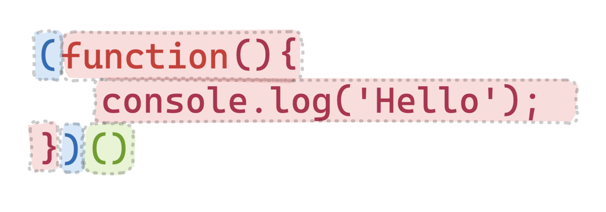

# What are anonymous functions?

An anonymous function (also known as a "_lambda_" or "block") is a function **without a name or identifier**.

**An example of an anonymous function in JavaScript**

```js
function () { ... }
// can also be achieved using ES6 syntax (arrow functions)
() => { ... }
```

**An example of an anonymous function in Python**

```python
lambda num: num + num
```

These functions cannot be referenced in code since they have no name, meaning they can only be used where they’re defined. They’re often used for a _one-time_ operation or short-term use at runtime.

Anonymous functions can also assist in cleaner code if the name of a function is not relevant (for example, when a function is only used once, or a limited number of times).

Any code you can write with anonymous functions could also be written with normal, named functions; it’s mostly a matter of style.

```js
function toStatus(item) {
  return item.status;
}
const statuses = items.map(toStatus);
```

## Why use anonymous functions?

Anonymous functions may help make your code _syntactically lighter, simpler_ and potentially cleaner, especially if you’re only using the function once.

An example of this might be when using callbacks (where a function calls a function passed in arguments), and you may not want to define a whole function for a callback.

```python
>>> numbers = [1, 2, 3, 4, 5, 6]
>>> list(map(lambda num: num*num, numbers))
[1, 4, 9, 16, 25, 36]
```

The function above maps each element in an array and multiplies it by itself.

I don’t really need to make an entire function definition just to multiply a number by itself, it’s a pretty simple operation.

Instead, we pass in an anonymous function to the `map` function which has one argument, `num` (this can be called anything).

```python
lambda num: num*num
```

Then, we just multiply `num` by itself. This function will run for each item in the list.

## Higher-order functions

Anonymous functions can be used in "higher-order functions”.

A higher-order function (HOF) is a function, which either takes a function as one or more of its arguments, or that takes in another function as an argument, or returns another function.

It sounds complicated, but you’ve likely used a `map` function for arrays, where that function needs _another_ function as an input to know how to map the items in the array.

```js
// The anonymous function is around the brackets after "map"
// For each item in the "items" array, it will take in the item as an input and return "item.status"
const statuses = items.map((item) => item.status);
```

## Immediately Invoked Function Expressions (IIFEs)

In JavaScript, you can use create **Immediately Invoked Function Expressions (IIFEs)** to create a function definition and call it at the same time:



- **Red**: the function definition (to run `console.log`)
- **Blue**: a set of brackets to seperate the function from the call operator (so it's syntactically valid – a right curly bracket cannot appear next to a left bracket)
- **Green**: the call operator.

At runtime, what’s seen is a function inside the green brackets, with a call operator right next to it. Whatever is inside the green brackets is “called” – in this case, the function definition in red executes.

IIFEs are typically used to create a scope, or quickly create and execute a function. It’s often used to quickly create an asynchronous environment to use `async/await`:

```js
(async () => {
  // we have access to `await` here, meaning we can do
  // asynchronous operations
  await fetch(/* ... */);
})();
```

<!--[PROPERTIES]
- slug: 'anonymous-functions'
  title: 'What are anonymous functions?'
  description: "What's the difference between a normal function and an anonymous function? What can we use them for?"
  image: cover.jpg
  createdAt: 1648166666000
  location: 'posts/anonymous-functions.mdx'
  readTimeMins: 4
  difficulty: Intermediate
  coverAuthor: Tom Roberts
  coverAuthorUrl: https://unsplash.com/@tomrdesigns
  author: Nevulo
  labels:
    - programming
    - javascript
-->
