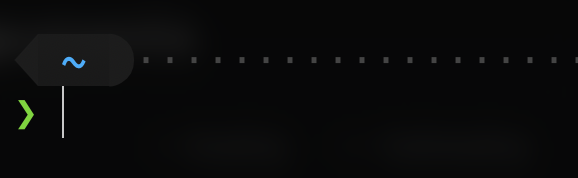
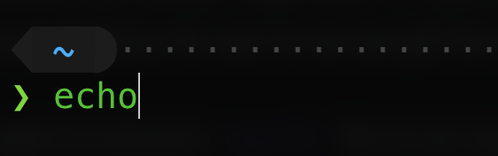
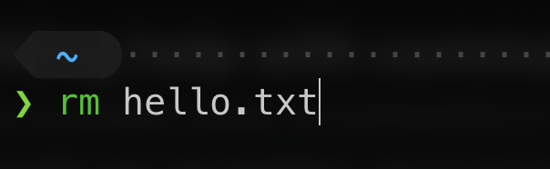

# How to use the command line

Whether it’d be in movies or over the shoulder of your “hacker” friend, it’s likely you’ve seen the mysterious command-line interface at one point or another. A window on the computer purely used for typing commands and getting back results in text.

Being able to use the command line with confidence opens some interesting doors and allows you to navigate your computer and automate tasks more effectively and efficiently.

But, if you’re starting out, it can feel like a steep learning curve coming from purely graphical interfaces. After all, when opened, all you’re left with is a blank screen and a blinking cursor. What are you supposed to write? What does it help us accomplish?

## First, what is the command line?

The command line, also known as the command prompt or terminal, is ultimately a window that lets us enter text to input commands, and can display the output of commands back to us in the same window.

It’s like having a text message conversation directly with your computer, where you can give more explicit instructions to the computer than you could through a normal graphical interface, or using a mouse. It’s essentially a different “mode” of interacting with your computer; anything you could typically do through a graphical interface, you can likely do on the command line as well.

The command line is also at the heart of a lot of automation. This allows us to write programs through scripts, a set of instructions to be carried out by the computer in a logical order.

## Why use the command line?

The main benefit from using the command line is providing a _consistent_ means of performing actions on your computer and the ability to _automate_ tasks. This is how your computer does a lot of the tasks it needs to do “in the background”.

Your software may use the command line to perform certain tasks such as reading/writing files, changing system preferences, or running other programs.

Imagine if we wanted to do a simple task like creating a folder, but we had to specify exactly where the mouse should be, and when to press the left or right mouse button. Considering the fact that everybody has different screen resolutions, different operating systems, and potentially different themes across systems, it’s pretty difficult to get it working for _everybody_ in a simple way.

To create a folder through the command line, we can just write:
`mkdir [folder name]`
(**m**a**k**e a **dir**ectory, a folder, where the name is `[folder name]`)

Simply put, utilising the command line can often provide more efficiency when performing complex tasks. Even though it can seem scary, it typically provides an easier and quicker way for us to do things like run applications that we make, test our software, and much more.

Many servers run operating systems with a foundation called “Unix”. These systems are characterised around modular design (known as the [Unix philosophy](https://en.wikipedia.org/wiki/Unix_philosophy)).

The idea is that the operating system provides a set of simple tools/programs, each with a well-defined function or purpose. You can construct a [pipeline](<https://en.wikipedia.org/wiki/Pipeline_(Unix)>) which feeds the output from one command to another, which can be combined into _complex workflows_ using a shell like [Bash](https://nevulo.xyz/blog/what-is-bash).

## How do you use the command line?

The best way to start learning to use the command line is _just using it_.
To start using the command line, follow the instructions, depending on which system you’re using:

### Windows

The “command prompt” is equivalent to the command line, and it can be launched just like any other program on your system. To start the Command Prompt:

1. Tap on the Windows logo in the taskbar
2. Start typing “cmd” (executable name for command prompt), click the first result.  
   You can also search directly for “Command Prompt”.  
   Optionally, right click and select “Run as administrator” to run with administrator privileges (take caution!)

### macOS

Launch the Terminal just like any other program on your system:

1. Open Spotlight search (Command + Space)
2. Type “Terminal” and click the first result.

### Linux

There are a few ways to open a terminal in Linux, but the quickest way is typically through a direct keyboard shortcut: `Ctrl + Alt + T`.
If the keyboard shortcut doesn’t work or is hard to remember, you can also launch the Terminal just like any other app on your system:

1. Press the `Super` key (acts as the “Windows” key on most keyboards)
2. Start typing “Terminal” in the search box at the top.

## Anatomy of the command line

### Prompt `>`

The very first thing you’ll see when booting up the command line/terminal is often an arrow, or some sequence of characters behind the text you’ll be entering. This is known as the “prompt”.

It literally prompts the user to act and type a command. It indicates the fact the system is ready to take commands. Don’t be alarmed if yours looks different, or if you’re not sure what everything means.

### Executables and commands

An executable file, command, or program is usually the first step in performing any kind of _action_ on the command line. Your system has hundreds, probably thousands of executables installed by default for performing common tasks, such as modifying files, running scripts, etc.

In the image above, `echo` is a command entered after the prompt. The purpose of the `echo` command is to literally _echo_ back what you write; whatever you insert as _arguments_ after the `echo` command will be printed back in the command line.

“`echo Hello world!`” would display “`Hello world!`” in the command line after you press ENTER.

### Arguments

Executables can accept “arguments” or “parameters” – these are essentially _inputs provided by the user_, so we can get the result we want.

If we want to remove a _specific_ file on our system, we can perform the _action_ through an executable (in this case, `rm` which removes files), and we can specify the file to be removed in the arguments:
`rm hello.txt`

The command above would remove a file called “hello.txt”, if it exists.

#### Options

Commands can also take what are known as [“flags” or “options”](https://pubs.opengroup.org/onlinepubs/9699919799/basedefs/V1_chap12.html), which are intended to _modify the behaviour of the program_ in some way.

For example, the `echo` command mentioned earlier has one option you can choose to pass in: `-n`. The purpose of this option is to change the behaviour of `echo`, so it doesn’t print a new line after printing the user input to the command line.

## Getting help with commands

As you’ve probably noticed, the command line is a lot more focused on functionality over user experience, and it’s not super apparent what some executables/commands do on the surface, such as `rm` or `mkdir`. Thousands of commands are out there, and it’s challenging to remember what most of them do.

If you need to get further details on what a certain command does, the easiest way to do this is often by typing `man [command]` in the command line. `man` is an executable used for displaying the online **man**ual pages for system commands and other definitions.

Some executables also include a `-h` or `--help` option to give more information about what’s available to you or what certain arguments do.

`git` is a great example of this; if you type in `git --help`, you’ll get a list of common commands you can use within the `git` executable. If you type `git branch --help`, you’ll get even more detailed instructions about how to use the `git branch` command specifically, and what arguments/options are available.

The methods listed above may be a bit verbose in some cases, and might not help you if you want a certain command explained in a simple way. You can often use search engines to help find better definitions for commands, or if you’re trying to find out what command you need to use for a certain operation.

As a rule of thumb (won’t apply to everything), the names of commands are typically just shortened versions or acronyms of the function they perform. If you want to **m**o**v**e a file, the command is `mv`, **c**o**p**ying a file can be achieved through `cp`, etc.

A tool I’ve used lately is [shell.how](https://www.shell.how/ "shell.how"), where you type in a command, and it’ll try to break down what each “part” of the command means.

## ⚠️ A word of warning

As I’ve talked about before, [computers are very literal-minded](https://nevulo.xyz/blog/what-is-xss). They really have no distinction between “good” or “malicious” instructions – they just do what we tell them to do.

Thus, it’s important to be cautious when entering commands directly in the command line. Unlike graphical interfaces, executing commands often comes with no warning or ability to undo, so you should avoid executing commands if you’re unsure of what they do.

The command line comes with a lot of power. It exposes low-level access to different parts of the system, so even innocuous, short commands can completely break your system or cause data loss if not used carefully.

I encourage you to do research if you’re unsure about what a command is supposed to do or why you’d need to run it. Stay safe!

<!--[PROPERTIES]
- slug: 'command-line'
  title: 'How to use the command line'
  description: "Knowing how to use (and master) the command line can help you gain a better foundational understanding of computers under the hood and automating tasks."
  image: cover.jpg
  createdAt: 1650540000000
  location: 'posts/command-line.mdx'
  readTimeMins: 6
  difficulty: Beginner
  coverAuthor: Lukas
  coverAuthorUrl: https://unsplash.com/@lukash
  author: Nevulo
  labels:
    - programming
    - cli
    - shell
-->
