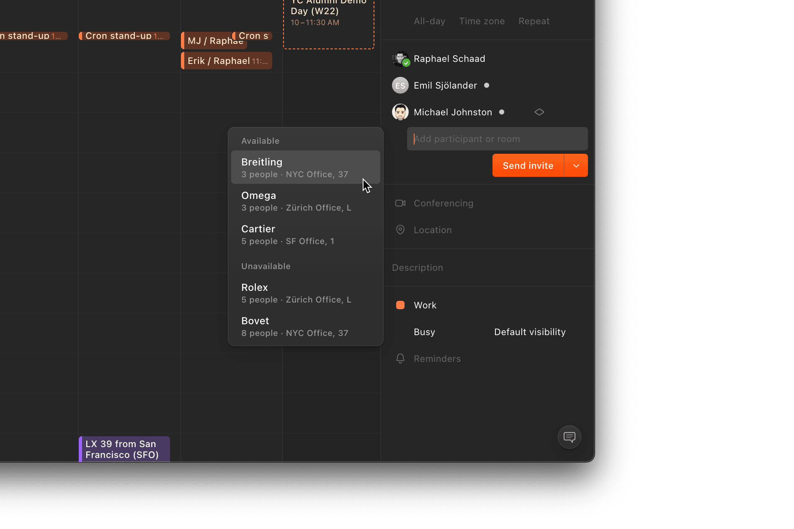

# Top tools to help you stay productive as a developer

I’m obsessed with squeezing out productivity wherever possible. Over the years, I’ve developed a workflow that helps me get work done effectively and efficiently. I’m a massive fan of having lots of information available at my disposal, while also remaining organised and clean (sometimes, at least 😅).

I’m also a big believer in tools and _apps_. In some cases, I think finding the right tool for the job (or in my case, a well-made application) can help you optimise your workflow to help you be more efficient and productive.

Everybody’s got a different definition of what it means to be productive. I’ll be mentioning 7 different types of applications I use daily as a software engineer to help me stay productive, why it helps me personally, as well as alternative applications to try to fit your needs!

## Terminal — iTerm

iTerm is a terminal for macOS which has all the features you could ever want. It describes itself as a “replacement” for the terminal, but I think it’s more of a re-imagination of the terminal and what’s possible to squeeze the most functionality out of a terminal for your productivity.

Here’s just _some_ of my favourite features iTerm offers out of hundreds:

- Splitting panes horizontally and vertically for maximum space-to-productivity ratio
- Powerful search (with regex support)
- Instant replay (travel back in time to recover lost text, super cool!)
- Auto-completion with a suggestion window

As for auto-completion and suggestions, an honourable mention goes to [Fig](https://fig.io/), a tool that integrates with your existing terminal to display smart suggestions and information when you’re stuck in the command line. Forgot certain commands or the structure of arguments? Fig is there to help.

Some fine alternatives to iTerm include [Warp](https://www.warp.dev/), a terminal built for the 21st century that looks and feels buttery-smooth. Very aesthetic.

Both of these are unfortunately only available for macOS currently (Warp is [planning for a Windows/Linux release](https://zachlloyd.typeform.com/to/lWeDTQnr?utm_source=www&typeform-source=www.warp.dev), however).
If you’re on Windows, the next best thing is probably the [Windows Terminal](https://github.com/microsoft/terminal), in my opinion. Not your standard “Command Prompt”; this is redesigned from the ground up to give you major customisation options with features similar to iTerm, while remaining performant with GPU acceleration.

## IDE — Visual Studio Code

Visual Studio Code is an integrated development environment (IDE) from Microsoft that focuses on simplicity while opening the door for extreme customisation, extension support and other advanced features to help you stay productive.

You can try out VS Code without downloading anything, [right in your browser](https://vscode.dev)!

Not interested in using software from a big corporation or buying into the hype? [Lapce](https://lapce.dev/) is an adequate alternative focused on great performance. Full disclosure—in my testing, things weren’t working so great, such as TypeScript syntax highlighting or opening certain files, and it is still under heavy development.

A more robust, battle-tested solution is [Sublime Text](https://www.sublimetext.com/). Initially released in 2008 and designed by [ex-Google engineer Jon Skinner](http://www.sublimetext.com/about), who had the goal of making a better text editor, Sublime Text has many similar features to VS Code, focused on speed and extensibility.

## Note-taking — Notion

I like to consider Notion to be a digital, opinionated piece of paper. You’re free to do whatever you want in whatever format you’d like, whether that’s note-taking, tracking expenses, formal specifications/documentation for a project, and so much more.

At its core, Notion has different types of “blocks” that build up pages that can be arranged in countless unique ways. Notion integrates with lots of different services which allows you to create _rich_ documents with embeds, maps, drawings, whatever your heart desires.

Another great alternative is going back to basics; pen and paper! There’s absolutely nothing wrong with taking notes in your notebook or on a loose piece of paper. I like the digital aspect, so I can search through old notes, link my thinking, and organise things when necessary.

## Calendar — Cron

It’s about time. According to Cron, at least.
[Cron](https://cron.com/) is a “next-generation calendar for professionals and teams”. I’ve been using Cron for about 3 months, and there’s a lot of little, nice things that help you juice that extra bit of productivity in your life.

Some notable things I, personally, love about Cron:

- Quick access to join meetings attached to an event with one click
- Integrates with the menu bar on macOS for easy access to see your next event
- See all the information you could ever need when planning new events/meetings, including the availability of invitees
- Automatically create Zoom links when creating meetings

I love the simplicity of Cron while remaining extremely functional. Cron is great at what it does; being a calendar. It’s great for time-management, blocking out time and giving me great access to information to make informed decisions around booking time with others.

As of writing, Cron is currently in early access, but with its recent acquisition by none other than [Notion](https://www.notion.so/product) mentioned earlier, it won’t be long before you can have access too!

In the meantime, there are two alternatives which also might help you be more productive and save time. If you find yourself spending more time organising your calendar than getting stuff done, why not let artificial intelligence take the wheel?

**[Reclaim](https://reclaim.ai/)** and **[Motion](https://www.usemotion.com/)** use the power of AI to automate your planning and create a more efficient, effective workflow to help you get around to everything you want to do.

## To-do tracker — Todoist

Life is basically one big to-do list. I’ve dedicated a lot of my time to finding a good to-do tracking application. Probably too much time.

In the end, for now, I’ve settled with **[Todoist](https://todoist.com/home)**. It simply has everything I need and more:

- The ability to track multiple projects (such as work, personal tasks, etc.)
- Setting deadlines and due dates, with the ability to set reminders
- Attach priority levels to tasks, so you know what’s important at a glance
- Works great with teams, allowing you to assign people to tasks as well as add labels

The most important thing for me personally, however, is the speed at which I can add new tasks and check off existing items. I’ve noticed as a software engineer, my day moves around a lot, and I’ve got many priorities.

![Todoist application with 26 tasks under the "blog improvement + features" section. 3 incomplete tasks are visible, the first task is "Email autofill field in newsletter subscribe box", the second task is "Add newsletter subscription banner on homepage". The final task is "Add favourite functionality with stars", which is due on July 5th and has 4 sub-tasks. The description for this task reads "Users should be able to upvote a discussion on GitHub relating to the blog post through custom interface". The 4 sub-tasks are: "Fetch star count for each post on build, revalidate when stale (1 hour)", "Allow authenticated users to star a blog post, sending upvote request to respective discussion on GitHub", "Allow users to remove star from post", "Add animation when starring posts".](assets/developer-productivity/todoist.png)

I’ve also often got a lot of “sub-tasks” to complete before I can call something truly done. Todoist provides a simple interface to give rich detail where necessary, while also allowing me to jot down new tasks when things change quickly.

There are so many alternatives to any to-do tracking app that I couldn’t possibly list them here. In the past, I’ve also made good use of [Trello](https://trello.com/), which has a lot of the same features, showing your tasks as cards in columns (known as a [kanban](https://www.atlassian.com/agile/kanban) board).

## Design — Figma

A lot of the applications listed so far are focused on simplicity with power under the hood to allow you to move quickly when needed, but also get the same value when it’s time to switch gears.

Figma is a wonderful example of this philosophy. It’s lightweight and gets out of your way, so you can draft up wireframes or sketches quickly, while giving you the power to create incredible, modern, and professional-looking designs.

Even though I’ve got practically no design skills, I was able to quickly create designs for my newsletter, [Nevuletter](https://nevuletter.nevulo.xyz), in less than an hour. It’s intuitive, and with all the functionality also accessible through their web-app, it’s a collaboration power-house.

I’ve used Adobe XD in the past, and it’s an absolute headache. I feel like Creative Cloud is an ever-growing virus – even if I wiped my computer, it’d probably still somehow launch at startup 😆

Jokes aside, Figma is outstanding for amateur and professional designers alike. If you’re a big fan of quickly getting ideas down into drawings or creating quick diagrams without worrying about your design skills, [Excalidraw](https://excalidraw.com/) is another great tool I can recommend.

I use Excalidraw for some images in my blog posts. It’s a great tool for creating quick diagrams and drawings to get your point across visually.

I’ve found it’s also helpful for planning, or just representing an idea to somebody in a really fast, dirty way, while remaining legible and pretty. Each drawing feels like it had effort put in behind it, thanks to the hand-drawn look Excalidraw provides.

## API Tooling — Insomnia

This one goes out to those working with APIs. [Insomnia](https://insomnia.rest/) is a dedicated API client, the main benefit being you’re able to hit any endpoint, supplying any data you need in requests to test that everything works properly and getting detailed information around the response for that request.

One thing I’ll admit around Insomnia (and why I sometimes prefer Postman) is the fact that it doesn’t support [path parameter variables](https://swagger.io/docs/specification/describing-parameters). It might be a bit niche, and Insomnia does have a good community and extension support, but I think Postman nails this down better.

Another alternative you might want to look into is [Paw](https://paw.cloud/) – it’s a paid tool, and only available for macOS, but it has everything most people would need. The design is simplistic and modern, my only gripe is that it is so feature rich that it has a bit of a learning curve, and some basic actions felt a bit buried in the UI.

## Conclusion

As of today, most of the tools listed here are my go-to’s. They’re the tools I keep reaching back for, to get the job done, and documenting them here feels like solidifying my “developer toolkit”.

I encourage everyone to create a short list of what you’re using today, for many reasons:

- You don’t forget what you’re using and why you’re using it
- To look back in the future to find improvements in your workflow (and celebrate that!)
- To help others find tools or workflows that you might be using in unique ways

At the end of the day, one thing I love is that everybody _does_ work differently, and I learn a lot when watching how other people work. I don’t use Vim or Emacs personally, but that’s just because that’s what works best _for me_. I know that plenty of people work faster than me using those tools and many other things I probably have no idea about.

What’s important to help you stay productive isn’t necessarily the _tools_, but rather your _workflow_, how you _use_ the tools to get you closer to your goals. At the start of this post, I mentioned that I’m a big “apps” guy. I love digital things and applications to improve my life, but it’s possible that might change, and that it’s different for you.

Keeping track of the tools you’re using, and broader goals, helps you stay productive as a developer, so you can find ways to improve your workflow.

<!--[PROPERTIES]
- slug: 'developer-productivity'
  title: 'Top tools to help you stay productive as a developer'
  description: "Applications I use in my workflow as a developer to stay productive, and tips for helping you flow through work"
  image: cover.jpg
  createdAt: 1655383355000
  location: 'posts/developer-productivity.mdx'
  readTimeMins: 8
  author: Nevulo
  keyIdeas:
    - Document your workflow and review occasionally to find potential improvements
    - A list of 7 different types of applications I use on a daily basis to improve my workflow personally
  labels:
    - programming
    - meta
    - productivity
-->
