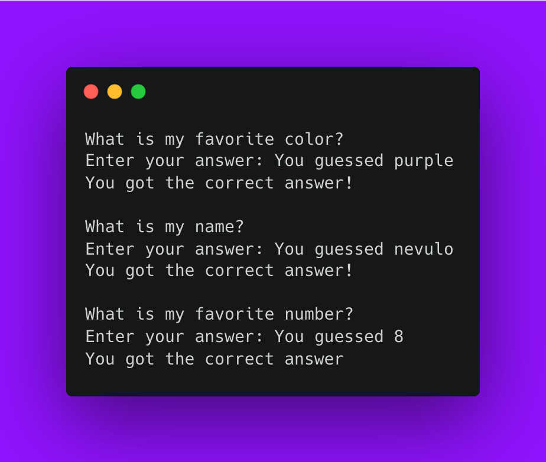

# How to get started with C\#

Getting started with C# can be pretty tricky, especially if you don’t know where to start. This is a step-by-step guide on how to start with C#, including all the tools you’ll need, explaining the different concepts you’ll use along the way to make an example console application. You can apply the techniques you’ll learn here for any kind of application though, such as windowed applications or games.

This guide will walk through what to install for working with C#, how to show text in the command line, storing user input in variables and using them to control state using conditional logic. We’ll use these skills to make a quiz!

## What is C# and what is it used for?

C# is a programming language made by Microsoft to be used primarily for developing _desktop applications_, web applications and services. It’s also a language that can be used for _game development_ in [Unity, a 2D/3D game building engine](https://unity.com/).

### What are the benefits of learning C#?

There are a few things that stand out about C#:

- It is more complicated than other languages like Python or JavaScript, but has a relatively low learning curve compared to other languages in the same class
- C# is very performant and capable
- Large community with numerous resources and documentation to help you along the way

## How to get started from nothing?

### 1. Opening your integrated development environment (IDE) or a text editor.

Having an IDE is very helpful for catching errors and having quick access to other utilities, but it’s not required to get your program up and running. If you’re looking for a good IDE, I’d recommend Visual Studio Community Edition for a fully-fledged code editor that can also compile your code, which you’ll need to run your code later in the guide.

One other thing to note is that this file should be saved as a `.cs` file for C#. This will be important when it comes time to compile our program.

### 2. Writing your first lines: logging something to the console.

Let’s start writing our program. Just to make sure everything is working properly, let’s first write some basic code to print something to the console, meaning the terminal where we’ll run our program from in a moment.

In your editor, start with these lines of code:

```cs
using System;
Console.WriteLine("Hello world!");
```

#### 🤔 What do these lines mean?

`using` is a keyword to say that you want to import a namespace (`System` in this case), and `Console` is a class inside that namespace. Think of it like saying, “give me access to system stuff, and write a line to the console saying ‘Hello world!’”.

In C#, each line must end with a semicolon (`;`) and the dot between `Console` and `WriteLine` means we’re accessing a method inside of `Console` which is `WriteLine`; this is an instruction for the computer to run the code inside `WriteLine` which tells the computer to write a line to the console/command line. The `"` quotation marks around the “Hello world!” text represents text for the compiler, you can read more about why this matters with [this data types post](https://nevulo.xyz/blog/what-are-data-types "this data types post").

### 3. Running your program.

#### If you’ve installed Visual Studio Community Edition

In the toolbar at the top, click the “Play” button, or you can press “F5”.
If you’re having trouble, there’s a [guide from Microsoft about how to run your program in Visual Studio](https://docs.microsoft.com/en-us/visualstudio/get-started/csharp/run-program).

#### Compiling from the command line

To compile from the command line, you’ll need to have the C# compiler installed on your system. If you don’t have Visual Studio Community Edition installed, you can download .NET 6.0 separately [from the Microsoft .NET website](https://dotnet.microsoft.com/en-us/download "from the Microsoft .NET website").

Once you’ve installed the .NET framework, you should be able to run `csc` from the command line. Run `csc (your file).cs`, and you should see an executable file in the same folder you ran the command.

## Let’s go further

Okay, great! We’ve got our first program that we can run and says, “Hello world!”. Let’s take this a step further – **let’s make a quiz!**

### Getting & storing input from the user

Let’s change the text in the `WriteLine` method to ask the user a question:

```cs
using System;
Console.WriteLine("What is my favorite color?");
```

To extend the functionality of our program, so users can input text in the command line, we’ll need to add a few lines of code:

```cs
string userInput;
Console.Write("Enter your answer: ");
userInput = Console.ReadLine();
```

#### 🧐 What does this code mean?

The `string` in front of `userInput` at the start means this variable `userInput` will store text. Now we’ve got a variable in memory; a place to store the user's answer to use later.

Similar to earlier, we’re calling the `Write` method on `Console` which reads for user input on the command line and the string we provide is what will show as the prompt.

Once the user presses enter to submit their answer, the `userInput` variable will be set to (using `=`) the value of whatever is returned from the `ReadLine` method (in this case, whatever the user just entered).
The parentheses `()` after `ReadLine` (and all the other methods) mean that we want to execute this method, and any data inside the parentheses are “arguments” that the method can use when running the code it has.

### Scoring the user with conditional branching

There’s pretty much one last thing our quiz needs, some way to show results.

Let’s bring in another concept: conditional branching, also known as “if statements”.
_If_ we wanted the only correct answer for our favourite colour question to be “purple”, the code would look something like this:

```cs
if (userInput == "purple") {
	Console.WriteLine("You got the correct answer!");
}
```

So now, only if the user types in “purple”, they’ll see “You got the correct answer!” in the console.

You’ll notice there’s parenthesis around the “condition” we’re testing, in this case: “user input equals purple”. If it’s true, the first “branch” is used (everything inside the `{` and `}`); otherwise, the code won’t be executed. The `==` represents the equality operator, meaning the value on the left side has to match the value exactly on the right.

We can also say “else, do something different” like this:

```cs
if (userInput == "purple")
{
	// ..
} else {
	Console.WriteLine("Wrong answer!");
}
```

…so, when a user types in something besides “purple”, they’ll see “Wrong answer!” in the console.
You can use `else if` to chain multiple conditions together and use the pipe character like this `||` to have more than one answer be correct:

```cs
if (userInput == "purple" || userInput == "blue")
{
	Console.WriteLine("You got the correct answer!");
}
```

### Adding more questions with arrays and loops

Let’s say we wanted to have more than one question before our program exits, how can we do this without repeating the code we’ve just written?

We can write loops in programming to say “the code within these brackets” should run a certain number of times.

```cs
for (int i = 0; i < 4; i++)
{
  Console.WriteLine(i);
}

// Prints:
// 0
// 1
// 2
// 3
```

The above is a “_for loop_”, and everything in parentheses after `for` are the statements used for initialising the loop, and knowing when to stop.

- The first statement `int i = 0` is only **executed once before the loop starts**; this is for initialising a variable called `i` to hold a number starting at 0 for knowing where we are in the loop.
- The next statement is `i < 4`: this is **checked on each iteration of the loop,** and the code inside the loop won’t be executed if this condition isn’t true.
- The final statement `i++` is executed **every time after the code in the loop executes**.

Overall, the whole loop code works something like this:

1. Start the loop by setting `i` to 0
2. Is `i` less than 4? If false, stop the loop.
3. If true, run the code inside the curly brackets
4. After executing the code in the loop, increment `i` by 1.
5. Go back to step 2

Great, now we know how to execute code multiple times over, now we just need some kind of list to store more questions:

```cs
string[] questions = {
	"What is my favorite color?",
	"What is my name?",
	"What is my favorite number?"
};
```

And it’d be good to have an equivalent list for storing the answers to these questions:

```cs
string[] answers = {
	"purple?",
	"nevulo",
	"8"
};
```

We can modify our code so all the logic we wrote before is contained inside the loop, so we're able to ask the user multiple questions in a simple way:

```cs
for (int i = 0; i < questions.Length; i++)
{
	string userInput;
	Console.WriteLine(questions[i]);
	Console.Write("Enter your answer: ");
	userInput = Console.ReadLine();

  	if (userInput == answers[i]) {
		Console.WriteLine("You got the correct answer!");
  	} else {
		Console.WriteLine("You got the wrong answer.");
  	}
}
```

Note that on the first line, the second statement (`i < 4`) from before has become `i < questions.Length`. Since the length of array `questions` is 3 (it contains 3 strings), this means that the code inside the loop will only be executed 3 times.

Using `questions[i]` and `answers[i]`, we can access the element at the index `i`, which will go from 0 to 2. Accessing `questions[2]` would yield the last question, and since the answers array has the same number of elements as the questions array, we're able to leverage the same variable to access the answer for a given question in the loop.

## The full, final code for the quiz

I’ve made some minor modifications to some parts to make it a better user experience, but your code should look something like this:

```cs
string[] questions = {
	"What is my favorite color?",
  	"What is my name?",
  	"What is my favorite number?"
};

// Create an array of strings, answers for questions above
// Each index in this array matches the index of array above
string[] answers = {
	"purple",
  	"nevulo",
  	"8"
};

for (int i = 0; i < questions.Length; i++)
{
    // Prepare a variable called "userInput" as text
    string userInput;
    // Print the question to the console
    Console.WriteLine('\n' + questions[i]);
    Console.Write("Enter your answer: ");
    // Let the value of userInput equal the next line of
    // input in the console; this instruction will make the
    // code wait until the user inputs their answer to continue
    userInput = Console.ReadLine();

    // Print what the user just guessed to the console
    Console.WriteLine("You guessed {0}", userInput);
    // If the users input is equal to whatever answer this
    // question is, tell user they got correct answer
    if (userInput == answers[i]) {
        Console.WriteLine("You got the correct answer!");
    // Otherwise, tell the user they got the wrong answer
    } else {
        Console.WriteLine("You got the wrong answer.");
    }
}
```



The basic idea at a high level is defining the questions we have in an array called `questions` and the same for `answers`.

Then, for however many questions there are:

1. Define a variable called `userInput` to store the user's input
2. Write the current question to the console
3. Prompt the user for their answer to the question
4. Read the input from the user once they press ENTER
5. Write the answer from user to the console
6. If the user's answer is equal to the expected answer for this question, write “You got the correct answer!” to the console
7. Else, if the user's answer is NOT equal to the answer for this question, write “You got the wrong answer.” to the console

## Conclusion

Congratulations on making one of your first programs using C#!

To recap on what you’ve learned from this small exercise:

- learning how to compile C# code
- variables (start with a data type like `string` or `int`, then the name of the variable – allow you to store data in memory to be used later)
- introduction to classes (like `Console`)
- methods (such as `WriteLine` and `ReadLine`, contain abstracted logic that can be executed to get a result)
- conditionals (if statements, printing different text depending on the state of the program)
- loops (avoiding repetition in code by running the same logic in a loop that you can run a certain number of times)

Everything you’ve learned here is enough to go further and start making really remarkable things, like mini-games with special rules or tools to help you be more productive.

You could even extend the functionality of this program.
Here’s one thing to try to test your knowledge: try adding a “you got x/y questions correct” log to the end!

<!--[PROPERTIES]
- slug: 'getting-started-with-csharp'
  title: 'How to get started with C#'
  description: "What is C#, what is it used for, and how do you make a basic command line app?"
  image: cover.png
  createdAt: 1644493673000
  location: 'posts/getting-started-with-csharp.mdx'
  difficulty: Beginner
  readTimeMins: 8
  author: Nevulo
  labels:
    - programming
    - c#
    - fundamentals
-->
