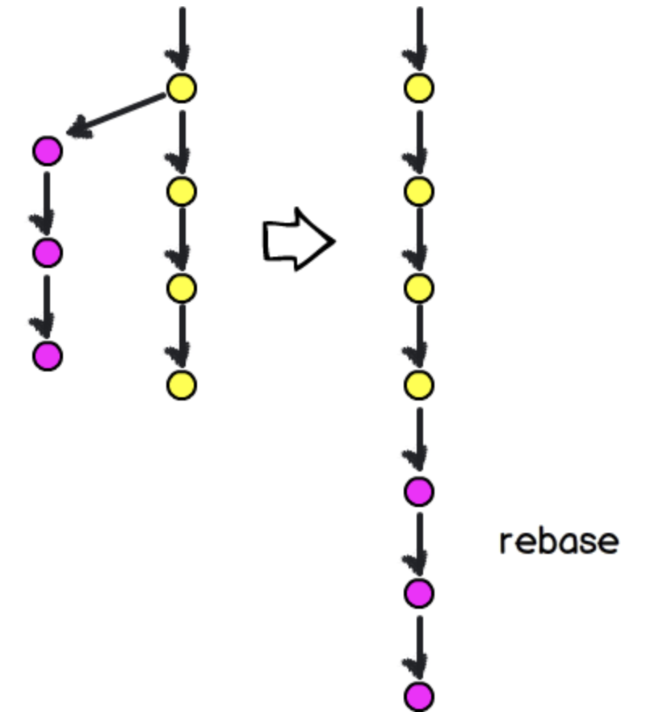

## What is rebasing? What does it mean to "rebase"?

Rebasing is essentially reconstructing commits in a branch to be _after_ a base commit (hence re-**base**). You can think of it like changing the base of the branch from one commit to another commit so that the Git history shows the commits in your branch as being applied after the last commit of the other branch.

It works like this: let's say you're on a branch called `develop`. When you run `git rebase origin/master`, all of the commits on `develop` are to be "replayed" on top of `origin/master`.

```bash
$ git checkout develop
$ git rebase master
First, rewinding head to replay your work on top of it...
```

As a reminder, `HEAD` represents the latest commit on a branch, so we're "rewinding" `HEAD` to be the last commit on the branch you supply to `git rebase` - in this case `origin/master`. Replaying a commit just means it will be recreated with the exact same data. You can think of this like an old VCR recorder that is rewriting the tape with different parts of video data. When rebasing, we're essentially rewriting history after a certain commit.




## How do you rebase?

From the command line, you can run `git rebase`. If tracking information is available for the branch (meaning it has an `upstream` set), it will use the upstream branch by default which will typically be the `main` branch. You can also manually specify a branch using `git rebase [branch]` (for example, `git rebase origin/main`).

After rebasing, when you want to push your changes to the remote branch, you'll need to force push with `git push` using the `--force` flag. This is essentially confirming that you know you're updating the remote branch with new commits and the old ones will be lost.

## Why would you want to rebase?

In all honesty, you won't find yourself needing to rebase all too often in Git. One common use case for rebasing is when you create a new branch off of the production branch (we'll call this `main`) and need to pull in remote changes. The last commit in `main` is the base commit for our new branch. Let's say a co-worker pushes some changes to `main` _after_ you created your branch.

To make sure your branch is up-to-date with `main` so you can eventually merge your branch into `main` when it's ready, you need to pull in your co-workers (remote) changes. You can either merge the changes **on top** of your existing commits in the form of a merge commit (which happens automatically when using `git pull`), or you can rebase, which allows you to have your co-workers changes integrated **before** your new commits, as if you created the branch from that point.

This has the advantage of making the Git history or `git log` more readable and straight-forward, rather than needing to deal with merge commits which may become messy in a busy repository. It also avoids conflicts when it’s time to create a pull request.

## When to rebase?

As explained earlier, rebasing rewrites history by rewinding to the latest commit on the target branch and then applying all of the commits in your working branch **on top** of the commits from the target branch.

This can be helpful if you _want_ to rewrite history. Let's say you accidentally pushed some code you shouldn't have...

```diff
+ SUPER_SECRET_CREDENTIALS=nobody should ever see this!
```

If you wanted to rewrite history to make it seem like this commit never happened, you can enter **interactive mode** by using `git rebase -i [branch]`. You'll enter a screen with a list of the commits to be rebased on your working branch (this is everything that will be "replayed"). In interactive mode, you have the ability to remove commits, squash them, etc. There's a list of commands you can use with the commits listed below.

A little further down, you'll also see:

"If you remove a line here THAT COMMIT WILL BE LOST."

Meaning if we delete a line containing a commit we don't want, it won't be applied on the branch and it will not appear in the history after rebasing. It will be lost to time.

## When **not** to rebase

Rebasing is good for making Git history and Git logs more readable so that commits follow a sensible timeline. However, since it rewrites history, it can also be dangerous and present some problems if you collaborate with others on the same repository.

Rebasing works internally by **recreating** all of the commits from the latest commit on the target branch, meaning if you create a new branch off from `main` called `new-feature`, add 3 commits and then rebase `main` into `new-feature`, the 3 commits you added to `new-feature` will not have the same commit hash that they previously did. A consequence of this is that now those old commits are essentially lost to history, and if there are other people who had your branch checked out before you rebased, those people will **need** to pull in your latest changes.

This is more apparent when rebasing while someone is in the middle of a review:


# Conclusion

Rebasing can be confusing, but it boils down to changing the history of a branch so that commits from a target branch will appear in the timeline as if they happened **before** any of your changes in your working branch. The official documentation for Git explains more about the specific details on [rebasing](https://git-scm.com/docs/git-rebase) and [rewriting history](https://git-scm.com/book/en/v2/Git-Tools-Rewriting-History).

<!--[PROPERTIES]
- slug: 'git-rebase'
  title: 'Rebasing in Git'
  description: "What does it mean to rebase in Git, and how do you do it?"
  image: main.png
  createdAt: 1635250336916
  location: 'posts/git-rebase.mdx'
  readTimeMins: 6
  difficulty: Beginner
  keyIdeas:
    - Rebasing means recreating local commits that you have on a branch to appear after remote changes
    - Even if the remote changes happened after your local commits and you pull them in, Git will "replay" your commits on top of the current branch
  labels:
    - git
    - cli
    - rebase
-->
