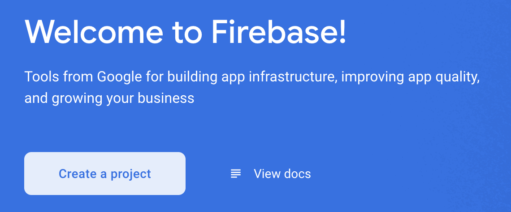
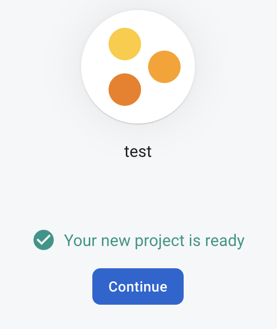
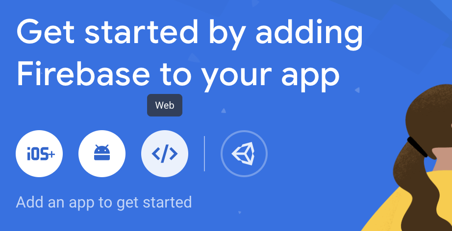
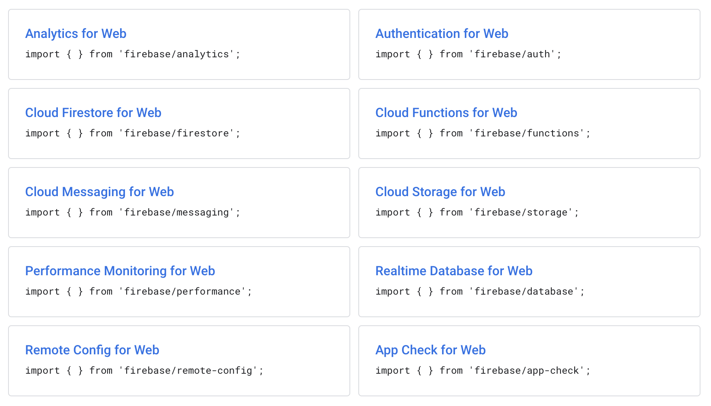

# How to set up Firebase in your JavaScript app

## What is Firebase?

Firebase is Google’s mobile application development platform that helps you build, improve, and grow your app. It's large in scope so generalising it to one sentence doesn't help, but essentially, it helps developers create production-quality apps faster by:

a) removing the need for a lot of [boilerplate](https://www.freecodecamp.org/news/whats-boilerplate-and-why-do-we-use-it-let-s-check-out-the-coding-style-guide-ac2b6c814ee7/ "boilerplate")such as setting up connections between servers or databases

b) offering services like database storage, server-less functions, monitoring/analytics and anything else you could possibly want

c) abstracting away complicated concepts that are typically unavoidable in other technologies like SQL.

Using Firebase, you can scale up or down your application as your needs suit.

## What's new in Firebase JS SDK version 9?

The Firebase team [released Firebase JS SDK v9](https://firebase.googleblog.com/2021/08/the-new-firebase-js-sdk-now-ga.html "released Firebase JS SDK v9") in August 2021 which includes a few notable changes over prior versions. Specifically, the API was refactored to be more compatible with tree-shaking, therefore producing smaller bundle sizes for your app. This is great because if you're not using many Firebase features in your app, they won't be loaded, shaving off wait times for users and increasing the speed of your app.

If you're upgrading from Firebase JS SDK v8 (non-modular), [take a look at this upgrade guide](https://firebase.google.com/docs/web/modular-upgrade "check out this upgrade guide") from Firebase, where you have the option of either updating only imports using the new `firebase/compat` module for a smoother transition, or refactoring your code to make use of patterns that better optimise for tree-shaking and dead code.

## Creating a Firebase project

Navigate to the [Firebase console](https://console.firebase.google.com/ "Firebase console") and click "[Create a project](https://firebase.google.com/docs/web/setup#create-project "Create a project")":



You'll be guided through a 3-step process for creating your Firebase application, including entering a name and configuring analytics. Wait a bit for your project to be set up, then click "Continue":



We need to do one last thing before we can install the Firebase SDK in our app; [register our app](https://firebase.google.com/docs/web/setup#register-app "register our app").

1. Click on the "**`</>` Web**" icon:
   

2. Enter a nickname for your app.

   > This nickname is an internal, convenience identifier and is only visible to you in the Firebase console

3. Click "**Register app**"

## Installing and initialising the Firebase SDK

### 1. Using your preferred package manager (`npm`, `yarn`) – install the Firebase module:

```bash
npm install firebase
# or
yarn add firebase
```

### 2. Initialise Firebase in your web app using the `initializeApp` method from `firebase/app`:

```js
import { initializeApp } from "firebase/app";
// TODO: Replace the following with your app's Firebase project configuration

const firebaseConfig = {
  // ...
};

const app = initializeApp(firebaseConfig);
```

Note that you'll need to populate **`firebaseConfig`** with your [Firebase config object](https://firebase.google.com/docs/web/learn-more#config-object "Firebase config object") - you can download your config object through the Firebase console in Project Settings, scroll down to "Your apps" and copy the contents of the `firebaseConfig` object from the code snippet.

Exporting the `app` variable may be helpful so you can always access your Firebase instance.

🎉 That's it!
Restart your app (if necessary) and Firebase should now be installed and accessible throughout your app.

When reading the Firebase docs for more help, make sure to select "Web version 9 (modular)" when checking out code snippets.

## Accessing Firebase in your app

Depending on what you want to do with Firebase, [there are many libraries you can import to start](https://firebase.google.com/docs/web/learn-more#libraries-nodejs "there are lots of libraries you can import to start"):



For example, if you would like to access Firestore, simply import Firestore in your project along with the `getFirestore` method to get your Firestore instance where you can start doing things like adding and querying for documents.

```js
import {
  getFirestore,
  collection,
  query,
  where,
  getDocs,
} from "firebase/firestore";

// firebaseApp is your app instance we initialized earlier
const db = getFirestore(firebaseApp);

const q = query(collection(db, "cities"), where("capital", "==", true));

const querySnapshot = await getDocs(q);
querySnapshot.forEach((doc) => console.log(doc.data()));
```

## Conclusion

Firebase is a powerful tool for developers who want to quickly implement common, helpful services like storage, analytics, testing, and so much more, without needing to manage other third-party integrations which may be inconsistent.

Everything is available for you to manage at your fingertips through the Firebase console, with the ability to scale up or down as needed. Firebase may not always suit your needs, but for developers looking to translate ideas into real apps quickly, this certainly helps.

If you're still confused about the new v9 syntax compared to v8, check out more information from Firebase about [refactoring to the modular (functional) style over time](https://firebase.google.com/docs/web/modular-upgrade#refactor_to_the_modular_style "refactoring to the modular (functional) style over time"), compared to the dot-chained namespace and service pattern in v8. An important distinction is that in v9, services are passed as the first argument to functions like `collection`, and the function then uses the details of the service to do the rest.

<!--[PROPERTIES]
- slug: 'how-to-set-up-firebase'
  title: 'How to set up Firebase in your JavaScript app'
  description: "What is Firebase, what does it offer for your website and how can you use it?"
  image: cover.png
  createdAt: 1644317093001
  location: 'posts/how-to-set-up-firebase.mdx'
  difficulty: Intermediate
  readTimeMins: 4
  author: Nevulo
  labels:
    - programming
    - javascript
    - integrations
-->
