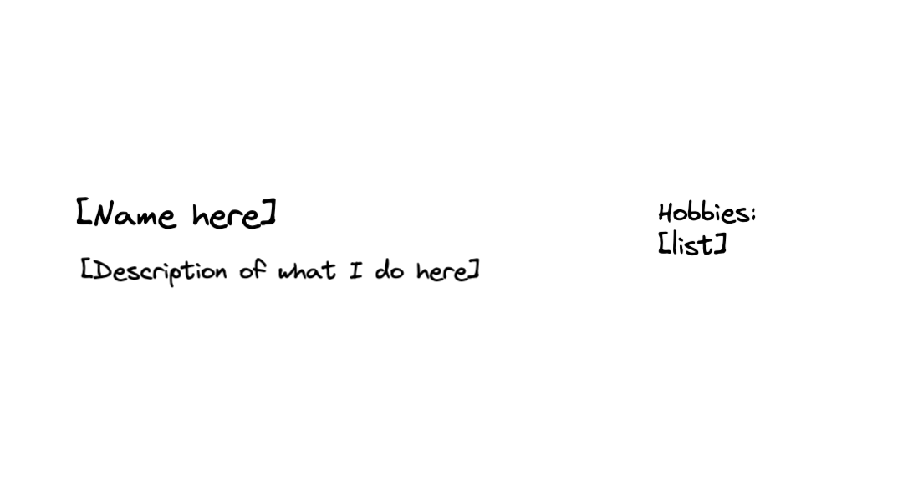
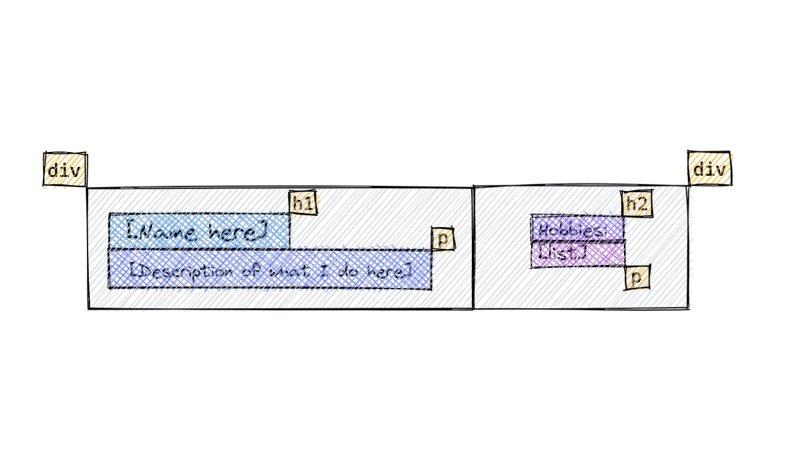
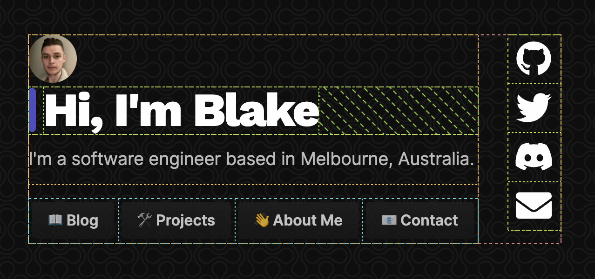
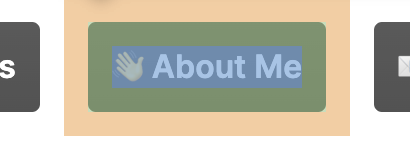

# Making your own website from scratch

The day comes where you’re looking to make your own website, maybe to increase your digital presence or allow others to find your work more easily.

You’ve got the standard “no-code” website builders like Wix, Squarespace, and hundreds of others. But what if you want _complete_ creative freedom?

What if there’s a template that isn’t out there, or you simply want to add a fancy parallax background that the builder you’re using doesn’t support?

Using a website builder to create your first website makes sense.
But, if you truly want the ability to stun people with a customised website that matches your brand to a tee, you can make a custom, static website from scratch using **HTML and CSS**.

## Why would I want to learn this?

There are many reasons why you might want to take the extra effort to write a website from scratch rather than using a no-code website builder, even as they’re on the rise:

- HTML appears everywhere, knowing how to read/write it can be useful
- It helps advance your knowledge as a developer
- It gives you full creative freedom; if you can think of a layout, with enough time and patience you can get it working how _you_ want on your website!

## What is HTML?

HTML stands for “Hyper-text Markup Language”, but it boils down to being the building blocks for how your website will appear to others.

HTML documents are up of lots of “elements” on the page for things like text, images, dividers, etc. Elements can have other elements inside them, building up bigger bits of the page, and ultimately the content as a whole.

HTML is a _“tag-based”_ language, meaning elements will be wrapped around angled brackets, and you’ll need to have a starting tag and an ending tag for most elements you have. Anything inside the tags will appear inside that element:

```html
<body>
  <p>This is some text</p>
</body>
```

So in this case, we have a HTML document with a `body`, and inside the `body` is a `p` (paragraph) tag where we can add some text.

There’s a bunch of different “tags” for different scenarios like wrapping text in a `<b>` tag to **bold** text, and `<div>` to make divisions in the page, just as a few examples. We’ll go into more detail about how to use specific tags a bit later.

## What is CSS?

If you think about building a website like building a house: you can think of HTML like the bricks, plaster, foundation for your house, and CSS as the coat of paint that goes over the house and on the walls.

“Cascading Style Sheets” (CSS) is a simple mechanism for adding style (e.g., fonts, colours, spacing) to web documents.

CSS works alongside HTML to style elements on the page, and there are hundreds of style transformations you can apply, like adjusting the width/height of an element, changing its colour, etc.

This is achieved through “selecting” an element on the document to style. CSS selectors allow us to apply a certain set of “rules” to an element to describe how that type of element should appear on the page.

If we wanted the `background` of the page to be `black` instead of `white`, we can change that through targeting the `body` of the document:

```css
body {
  background: black;
}
```

Any properties we want to apply will be inside the curly braces, and each of the “rules” will start with the element we would like to select.

## How can we get started making a basic website?

### Open your preferred text editor or IDE

It’s never required to use an integrated development environment (IDE) when writing HTML or CSS, but it can make things easier to read, especially as your code grows.

First thing is to write `<!DOCTYPE HTML>` at the top of the file:

```html
<!DOCTYPE html>
```

Your website will work without this line, so don’t stress if you forget to add it, but it’s good practice to include at the top of your file, so all browsers know exactly how to parse your file.

You’ll want to save your file as a **`.html` file**, which gives us the ability to open our code in the browser later to see how it looks.

### Your first elements on the DOM

After the `DOCTYPE` line, let’s start writing actual elements that will show up on the user's screen.

It’s good practice to have the first element (being the root of the document) as the `html` tag:

```html
<!DOCTYPE html>
<html></html>
```

#### The `head` element

The header (`<head>`) element is where you can store metadata about the document, like the title that shows up in the browser tab, any external scripts your site uses (not relevant for us now), and many other things.

Importantly, it’s a place to store [style sheets](https://developer.mozilla.org/en-US/docs/Web/HTML/Element/style) using the `style` element. This is where we’ll put our CSS that we’ll write later.

Here’s an example of what your `head` element might contain:

```html
<head>
  <title>My awesome website</title>
  <style>
    // CSS goes here
  </style>
</head>
```

#### The `body` element

This is the body of your document, and where all of your main content will be. Basically, everything on your page will be _inside_ this element.

Here’s an example of a complete HTML document with the `body` element:

```html
<html>
  <head>
    <!-- metadata here (title, styles) -->
  </head>
  <body>
    <p>Hey there!</p>
  </body>
</html>
```

#### Headers (`h1`, `h2`, `h3`…)

There’s 6 different “level heading” elements which you can wrap around text to make it bigger or smaller on the page. This is useful if you want to add a title or headers to your page to make it more readable and appealing.

`h1`, `h2`, `h3`, `h4`, `h5`, and `h6` are all elements used to apply styling to text (and other elements inside) which makes text bigger.

Heading level `1` is the biggest, then as the number gets bigger, the text gets smaller.

###### So `h6` would be super tiny.

```html
<h1>Super big title</h1>
<h2>Subtitle</h2>
<h3>Smaller subtitle</h3>
<h4>Smaller header</h4>
<h5>Even smaller header</h5>
<h6>The smallest header there was</h6>
```

#### Adding a `p`aragraph to our page

What’s a title without some content under it? This is where you can use the `p` (paragraph) element, which has a small font size suitable for normal writing.

```html
<h1>Making your own website from scratch</h1>
<p>The day comes where you're ...</p>
```

### Getting fancy with `div`iders (containers)

There are many other elements which are useful to know, you can find [a whole list here](https://developer.mozilla.org/en-US/docs/Web/HTML/Element).

The `div` element may be the most useful if you’re looking to divide content on your website, like a box to put text in.

Putting elements inside other elements is a fundamental part of building a website with HTML, and you can start to create some more advanced components on your page by wrapping elements in containers like a `div`.

To give an example, let’s say we wanted to create a layout like this:


We can envision how the layout might look in our HTML code by thinking about the different elements it would take to show each little “bit” on the page. Things like text, headers, and larger containers to divide _sections_ of the page.


By default, a `div` will only take up as much space as the child elements inside it (as seen above, not with that much spacing though).

Using `div`s (and some styling), you can build layouts that work like LEGO blocks if you want to make more complicated layouts like a landing page.



To give you an idea of how powerful grouping elements with `div`s can be, in the image above, each box represents an element, like `h1` for “Hi, I’m Blake”, `button` elements for the buttons, etc.

Most importantly, the content is grouped into 3 containers (`div`s), one container wrapping the whole content, one container for everything except the social icons, and a separate container for the social icons.

```html
<div>
  
  <div>
    <h1>Hi, I'm Blake</h1>
  </div>
  <p>I'm a software engineer based in Melbourne, Australia.</p>
  <div><!-- buttons --></div>
</div>
```

You can see how the boxes (with some extra styling) come together and stack to create the interface we want. However, `div`s on their own with no styling won’t stack content horizontally, like you see with the social icons being next to the text in the image above. To get that effect, we’ll need to start styling our `div`s.

### Styling our content

Currently, our website probably looks a bit bland because the elements on our page are just showing as-is without anything telling the browser to give space or padding around certain elements. Let’s add some styling to our elements to make our website fancy 💅

#### Adding a `style` tag to our `head`

The simplest way to add styling to our site is including CSS inside a `style` element in the `head` element.

```html
<head>
  <style>
    body {
      background: black;
    }
  </style>
</head>
```

You can include CSS rules inside the `style` element to target any existing elements in your HTML code, like changing the way the `body` of the document appears, or what colour a `p` element should be.

#### Breathing room

If you want to add spacing between elements, you can use `padding` and `margin`.


`margin` is represented in orange - you can think of `margin` like as how much space there is between other elements; like a forcefield around _the outside of the element_ that pushes others away.

This is great for giving just the right amount of breathing room between different elements.

You can specify how many pixels the `margin` and `padding` will be, where higher values will make the spacing larger.

```css
div {
  padding: 12px;
}
```

`padding` on the other hand is how much space there is _inside_ the element. In the case of this button, the blue represents the actual size of the element, and the green is the padding around the element, like a cushion that literally makes the element bigger.

This is helpful if you want “internal” space in an element like making the size of a button bigger, or giving space between the edge of child elements

#### Adding classes to elements

To aid in selecting specific elements on the page instead of **all** elements of the `div` type for example, we can add classes to our elements in HTML using the `class` attribute:

```css
<div class="box">
	<div class="left">
		<h1>Hi there</h1>
	</div>
	<div class="right">
		
	</div>
</div>
```

#### Using Flexbox to structure our layout

To give our site some proper structure, we can use “flexbox” which is a flexible box display layout we can use to specify the direction the content should be oriented, how child content should shrink/grow in size, etc.

Start by selecting a divider as a container for your content, preferably with a class name to access it through your CSS easier using a dot in front of the class name:

```css
.box {
  display: flex;
}
```

We can make the direction of the flexbox be `column`, which makes content stack vertically, or `row` which makes the content stack horizontally:

```css
.box {
  flex-direction: row;
}
```

Finally, we can centre the entire container with our content in the middle of the page using `align-items: center`, which _horizontally_ centre the content, and `justify-content: center` which _vertically_ centre the content on the page:

```css
.box {
  display: flex;
  align-items: center;
  justify-content: center;
}
```

<!--[PROPERTIES]
- slug: 'making-your-own-website'
  title: 'Making your own website from scratch'
  description: "An introduction to HTML and CSS - the foundation and styling for any website"
  image: cover.jpg
  createdAt: 1645742781000
  location: 'posts/making-your-own-website.mdx'
  difficulty: Beginner
  readTimeMins: 8
  author: Nevulo
  labels:
    - programming
    - html
    - css
-->
