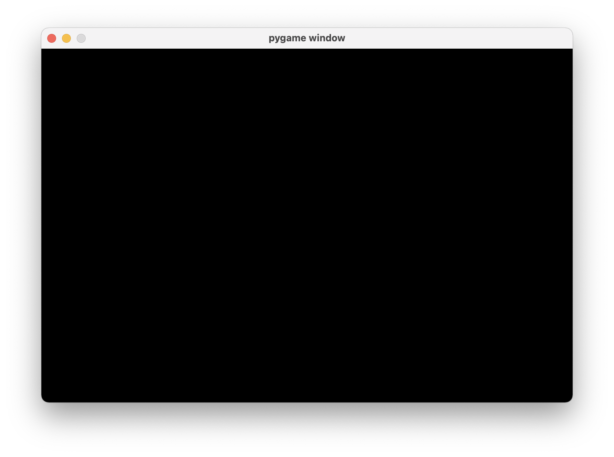
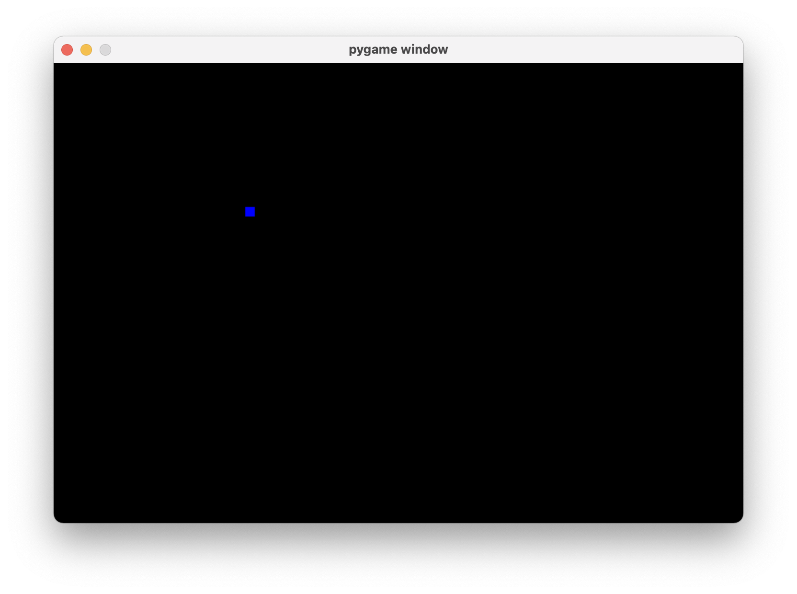
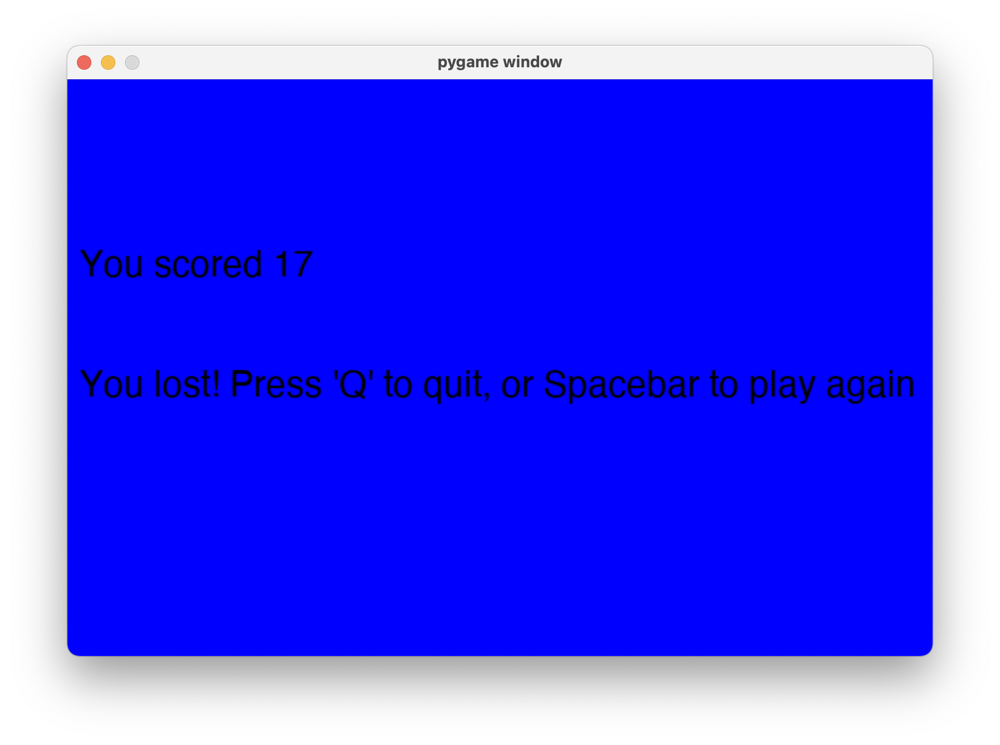
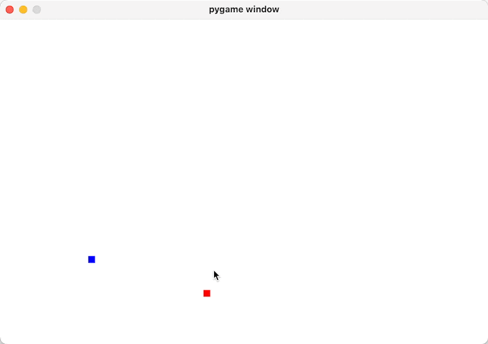

# Making Snake in Python

Python is a beginner-friendly language that makes it easy to dive straight into making your own games with a graphical user interface (GUI). In this guide, we’ll walk through the basics of setting up a Python installation, creating a window to display our game, and updating the window with a fully functional snake game.

## 1. Install Python.

If you haven’t already installed Python, you can [download it from here](https://www.python.org/downloads/ "download it from here"). Click “Download Python (version)” and go through the installation process.

## 2. Open your text editor or IDE.

Having an IDE is helpful for catching errors and knowing when your syntax is wrong quickly, but you can always program using a normal text editor, like Notepad or TextEdit.

Open it up and save the file with the `.py` extension, this means it’s a Python script which we’ll be able to run from the command line later.

## 3. Let’s get a window up.

We want our snake game to appear in a window that the user can interact with, like any other application. To achieve that, we’ll need to install a dependency.

### What’s a dependency?

A dependency is code from another location that we import into our code. It’s called a dependency because our code _depends_ on the other person’s code to work.

We’ll need to install the `pygame` dependency to make our game, and we can install it by using `pip` on the command line, which comes with the Python installation. `pygame` allows us to quickly develop a game and handles all the complicated logic for us.

### Installing the `pygame` dependency

Open a command prompt and type in `pip install pygame`, wait a little and `pygame` should be available to use in your code.

We can `import` it into our code:

```python
import pygame
```

Great! We’ve got `pygame` in our code. Now what? Well, we want to show a window to display our snake game, how can we do that with `pygame`?

### Initialising a window

`pygame` has a few “helper methods” for things like modifying the display window, events, etc. Inside `pygame.display` is a `set_mode` function which tells the computer to initialise a new window to be displayed on the screen.

```python
import pygame

screen_width = 720
screen_height = 480
screen = pygame.display.set_mode((screen_width, screen_height))
```

We set a `screen_width` variable to equal `720` and `screen_height` to equal `480` to use in `set_mode`, so we can initialise a window that is 720×480.

In the code above, we’re saying “let the variable `screen` equal the return value of `set_mode`”, which is a `Surface` object.

Now that `screen` _is_ a `Surface` object (which represents the contents of the window), we're able to do things like change the background colour:

```python
screen.fill((0, 0, 0)) # 0, 0, 0 is RGB code for the colour black (0 red, 0 green, 0 blue)
```

We need to tell `pygame.display` to update whenever we make any changes we make to the `screen`, like changing the background colour. This is done by calling `pygame.display.flip`:

```python
pygame.display.flip()
```

### Updating our game on a loop

There’s just one last thing before we’re past the first hurdle of bringing up a window properly: the event loop. What is it?

The event loop represents any actions or things that are happening in your game, including when the user quits your app.

```python
snake_speed = 30
clock = pygame.time.Clock()
running = True
# While "running" is true
# (always true unless user quits):
while running:
	screen.fill((0,0,0))

	pygame.display.flip()
	clock.tick(snake_speed)

	# Get the next events from the queue
	# For each event returned from get(),
	for event in pygame.event.get():
		# If the event is "QUIT"
		if event.type == pygame.QUIT:
			# Set running to False, stop event loop
			running = False
```

You can think of executing `pygame.event.get()` like walking the next “step” your game will take. If you don’t have `pygame.event.get()` running in a loop, your game won’t really work. It’s also important that we move any updates we make to the screen inside the loop, so we’re constantly updating the contents of the screen on each frame.

The `clock` variable allows us to specify how fast our game should update. This is not super necessary, however if you find that the snake moves too fast you can make `snake_speed` a smaller value. You can also increase it to make the game more challenging!

## 4. Running our program.

If we run the script as it is now, we should see a little window with a black background pop up on the screen!



This is all it is now, but it will become a functional snake game 🐍

## 5. Adding the actual snake.

Okay, we’re done getting excited about windows now. Let’s get a snake in the damn window.

To draw graphics on the screen like a rectangle for our snake, we’ll need to call `pygame.draw.rect`, passing in the following as arguments:

- The **display we want to update** (the `screen` variable in our case)
- The **colour** this rectangle should be (define a variable `blue` with the HEX value for the colour blue)
- The **coordinates** to draw the rectangle on the screen and how big it should be
  - The first two numbers `200` & `150` represent the **X** and **Y** coordinates for where to display the rectangle
  - The last two numbers represent the **size** of the rectangle, `10` by `10` pixels.

```python
blue = (0, 0, 255) # RGB code for blue
pygame.draw.rect(screen, blue, [200, 150, 10, 10])
```

Include this call before the line where you update your screen, run your program again, and you should see a small blue square near the top left of your screen!


## 6. Moving the snake.

To move the rectangle that’s being drawn to the screen, we need to do three things:

1. Storing the current position of the snake

   ```python
   # Set the snake in the middle of the screen
   snake_x = screen_width / 2
   snake_y = screen_height / 2
   ```

2. Storing the current speed of the snake, so we know where (and how much) to move the snake on the next frame
   ```python
   speed_x = 0
   speed_y = 2
   ```

These first two things should be defined at the top of your script after importing `pygame`, so we can use them later on.

3. Listening for keyboard events such as the arrow keys to control movement
   ```python
   # Handling key events
   for event in pygame.event.get():
   	# If the event is "KEYDOWN"
       if event.type == pygame.KEYDOWN:
   		# Go up on arrow key UP
           if event.key == pygame.K_UP:
   			speed_x = 0
              	speed_y = -2
   		# Go down on arrow key DOWN
           if event.key == pygame.K_DOWN:
   			speed_x = 0
              	speed_y = 2
   		# Go left on arrow key LEFT
           if event.key == pygame.K_LEFT:
   			speed_y = 0
              	speed_x = -2
   		# Go right on arrow key RIGHT
           if event.key == pygame.K_RIGHT:
   			speed_y = 0
              	speed_x = 2
   ```

To make the snake move when we press one of the arrow keys, we need to **update our event loop** to listen for a specific `event.type` (KEYDOWN, a key being pressed down) and also the type of key being pressed to know how to change the snake's speed.

With all this, we can now update the speed of the snake on every frame to get our snake moving!

```python
# Update the speed of the snake
snake_x += speed_x
snake_y += speed_y
```

It should look something like this so far:

```python
import pygame

screen_width = 720
screen_height = 480
screen = pygame.display.set_mode((screen_width, screen_height))

# Set the snake in the middle of the screen
snake_x = screen_width / 2
snake_y = screen_height / 2
speed_x = 0
speed_y = -2

running = True
while running:
	screen.fill((255, 255, 255)
	pygame.draw.rect(screen, blue, [snake_x, snake_y, 10, 10])
	# Update the snake's X & Y position each frame based
	# on speed
	snake_x += speed_x
	snake_y += speed_y
	pygame.display.flip()

  	for event in pygame.event.get():
	    # If the event is "KEYDOWN"
    	if event.type == pygame.KEYDOWN:
      		# Movement (up, down, left, right arrow keys)
      		if event.key == pygame.K_UP:
          		speed_x = 0
				speed_y = -2
      		if event.key == pygame.K_DOWN:
          		speed_x = 0
          		speed_y = 2
      		if event.key == pygame.K_LEFT:
          		speed_y = 0
          		speed_x = -2
      		if event.key == pygame.K_RIGHT:
          		speed_y = 0
          		speed_x = 2
		if event.type == pygame.QUIT:
      		# Set running to False, stop event loop
      		running = False
```

## 7. Spawning fruit.

We need to define the position for the fruit near the top of our file, after our imports:

```python
fruit_x = 300
fruit_y = 400
red = (255, 0, 0)
```

We’ve also defined a variable for the colour red, which we’ll use to draw the fruit.

To draw the fruit on the screen, draw another rectangle on the screen each frame where the fruit will be located: this code will run in your game loop

```python
pygame.draw.rect(screen, red, [fruit_x, fruit_y, 10, 10])
```

## 8. Growing the size of the snake when eating a fruit.

Now that we have fruit spawning on the map, we want to do two things to replicate snake:

1. Spawning the fruit in a new location when the snake goes over it
2. Incrementing the size of the snake by 1

### Re-spawning fruit when eaten

Let’s knock the first thing out of the way: spawning the fruit in a new place when the snake goes over it. How can we do this? Well, we know the position of the snake at all times, as well as the position of the fruit.

In this case, it’s as simple as checking for if the `x` and `y` position match for both the fruit and the snake:

```python
# If the snake is touching fruit (x and y position match for snake head and fruit), set the fruit to a new, random position
if snake_x == fruit_x and snake_y == fruit_y:
	# ⚠️ Make sure to "import random" at the top of your file!
	fruit_x = round(random.randrange(0, screen_width - 10) / 10.0) * 10.0
	fruit_y = round(random.randrange(0, screen_height - 10) / 10.0) * 10.0
```

This logic is saying “_pick a random new location for the fruit’s `x` position, making sure it’s within the left and right side of the screen_”. The same logic applies for the `y` position of the fruit.

We’ll need to add `import random` at the very top of our file for this code to work, since we’re using the `random` module to generate a random range to spawn the new fruit.

### Adding length to our snake

When we eat fruit, we want to increment the length of the snake by 1.

We’ll need some place to store the current length of the snake (put this near the top of your file):

```python
snake_length = 1
```

We’re also going to need to change how we update the snake on the screen, currently its only drawing one rectangle each frame, but we wish to draw one new rectangle as the value of `snake_length` goes up.

Define a new variable called `snake_blocks` as an empty list at the top of your file to track all the rectangles we’ll have to draw for each point the user has:

```python
snake_blocks = []
```

Now we just need some way to keep _appending_ new blocks to the end of the snake
At the top of your game loop, add this logic to continuously push the snake's current `x` and `y` position (as a list) to `snake_blocks`

```python
# Set the snake head to the current position, append to snake blocks to keep track
snake_head = []
snake_head.append(snake_x)
snake_head.append(snake_y)
snake_blocks.append(snake_head)
```

But since this is running in a loop, it will just keep adding more and more blocks to `snake_blocks` forever. If the user has eaten 7 fruits, the snake should have 7 blocks (plus one for the snake head).

So, inside the game loop, we want to check if the length of the `snake_blocks` we have stored is greater than the `snake_length`, and remove the first block if so. This will stop our snake from infinitely growing!

```python
# Ensure the snake is only as big as the length we've set, delete the end blocks
if len(snake_blocks) > snake_length:
    del snake_blocks[0]
```

Replace the `draw.rect` call to update your snake with the code below to loop through each of the snake blocks and draw a rectangle on the screen.

```python
# Draw a snake block for each point the user has
for block in snake_blocks:
  pygame.draw.rect(screen, blue, [block[0], block[1], snake_size, snake_size])
```

The value of `block` in this `for` loop will be a list, the first element (`block[0]`) represents the `x` position for that block, and the second element (`block[1]`) represents the `y` position.

Lastly, we want to add `1` to `snake_length` when we pass over fruit, so go to the code we added where we’re checking for the `x` and `y` position of the snake and fruit being the same, and add a line to let `snake_length` equal itself plus `1`:

```python
if snake_x == fruit_x and snake_y == fruit_y:
   snake_length += 1
   fruit_x = round(random.randrange(0, screen_width - 10) / 10.0) * 10.0
   fruit_y = round(random.randrange(0, screen_height - 10) / 10.0) * 10.0
```

## 9. Game over!

By this point, our snake game is working great. One thing I haven’t touched on though is the loss condition.
Typically, in snake, the game ends when you:

- Touch the edge of the screen, or
- You bump into your tail.

A good place to start would be to define a boolean variable (true or false) for the game over state:

```python
game_over = False # put at the top of your file after imports
```

### Touching the edge of the screen

When the snake goes past the edge of the screen, we want to set `game_over` to `True`:

```python
# If the snake goes beyond the left or right side of the screen,
if (snake_x >= screen_width or snake_x < 0 or
  # If the snake goes beyond the top of bottom of the screen,
  snake_y >= screen_height or snake_y < 0):
    # Set game over to true
    game_over = True
```

Here, we’re checking if the `x` position of the snake is greater than or equal to the width of the screen **OR** if the `x` position is less than 0.
What does this mean in practice? Since we’ve defined the `screen_width` as `720`, if our snake goes too far right on the screen making the `snake_x` variable go past `720` (or too far left, making it go below `0`), we know the snake is on or past the edge of the screen, meaning it’s game over.

The same checks above apply for the `y` coordinate too (up and down movement), so if the snake goes above the top of the screen or below the bottom of the screen, `game_over` will be set to `True`.

### Running into your tail

We also wanted to end the game if the snake’s head touches its tail.

```python
# Not counting the snake head, check if any other existing snake blocks are crossing over the snake head (dead)
for x in snake_blocks[:-1]:
  if x == snake_head:
    game_over = True
```

The special `[:-1]` after `snake_blocks` is a “slice”, and this specific slice means “get all the snake blocks except the last one”.

Slice notation in Python looks like this: `x[start:stop]`, and in our code above we’re omitting the `start` value (which defaults to `0`) by just putting a colon (`:`). Next is the `stop` value which says at what index to end the slice, in this case it’s `-1`, so what does this mean?

In slice notation, _negative indices will roll over to count from the end of the array instead of the start_.

So, if we had a snake with a length of `5`, `snake_blocks[:-1]` in our case would start at `0` (like it normally does), and end at whatever the length of `snake_blocks` is minus `1`.

In practice, this prevents an issue where `game_over` will constantly be `True` because the snake head position will always equal itself.

### Showing a game over screen

Excluding the `pygame.display.flip` call, the `clock.tick` call and the event `for` loop, move all the logic in your game so far into an if condition (if the game has not ended):

```python
# If the user hasn't lost the game:
if not game_over:
	screen.fill((255,255,255))
	# ...
else:
```

Our game over screen logic will be inside the `else` statement. Let’s start with a blue screen if the game is over:

```python
# Game over logic (screen showing users score + how to continue)
else:
    screen.fill(blue)
```

So now, when the user hits the edge of the screen or runs into their tail, the screen will turn blue.
Let’s add some text to this screen to let the user know what their score was.

To add fonts and text into our game, we need to define the font we want to use in a variable at the top of the file, after the `import`s:

```python
font = pygame.font.SysFont('Arial', 30)
```

Then, we can call `font.render` with the text we wish to render on the screen. The second argument (`True`) is for anti-aliasing the font (you likely want to leave this as `True` to make the font smooth), and the last argument is what colour the text should be.

```python
score = font.render('You scored ' + str(snake_length), True, black)
```

Something to keep in mind though is that `font.render` **won’t** actually make any text appear on the screen just yet; we’ll need to save the result of `font.render` to a variable which we can use to apply the text on the screen in a certain position using `screen.blit`. `blit` is a confusing name ([computing term](<https://en.wiktionary.org/wiki/blit#:~:text=blit%20(plural%20blits),to%20animate%20two%2Ddimensional%20graphics.> "computing term")), but it essentially means to draw one surface on top of another surface.

```python
screen.blit(score, (10, screen_height / 2 - 100))
```

The second argument is where we want the text to appear on the screen – the `x` and `y` coordinates. In this case, we’re saying we want the score to appear 10 pixels from the left side of the screen and halfway down the screen, minus 100 pixels, just so it appears a bit higher than halfway.

### Allowing the user to restart

In your event `for` loop, inside the check for `KEYDOWN`, let’s add a check to see if the spacebar has been pressed:

```python
for event in pygame.event.get():
	# If the event is "KEYDOWN"
	if event.type == pygame.KEYDOWN:
		# If space is pressed, reset game
		if event.key == pygame.K_SPACE:
			game_over = False
			snake_x = screen_width / 2
			snake_y = screen_height / 2
			snake_blocks = []
			snake_length = 1
```

The last 4 lines are just resetting variables to their default value, so when the user restarts the game, they start out in the middle of the screen and have no length on the snake.

Using what we learned from earlier about drawing text on the screen, let’s also draw some instructions when the game is over, so the user knows how to restart:

```python
# Game over logic (screen showing users score + how to continue)
else:
	screen.fill(blue)
	score = font.render('You scored ' + str(snake_length), True, black)
	screen.blit(score, (10, screen_height / 2 - 100))
	text = font.render('You lost! Press \'Q\' to quit, or Spacebar to play again', False, black)
	screen.blit(text, (10, screen_height / 2))
```



## The full, final code for our Snake game



I’ve done some minor clean-up as well as adding additional comments to explain some logic, but this is all the code to get a fully functional snake game with things like score tracking, eating fruits and a game over state.

```python
import pygame
import random

### Initialization
pygame.init() # Not necessary
font = pygame.font.SysFont('Arial', 30)

# Colours
blue = (0, 0, 255) # hex code for blue
black = (0, 0, 0) # hex code for black
red = (255, 0, 0) # hex code for red
screen_width = 720
screen_height = 480
screen = pygame.display.set_mode((screen_width, screen_height))

# Set the snake in the middle of the screen
snake_x = screen_width / 2
snake_y = screen_height / 2
snake_speed = 30
snake_size = 10
snake_length = 1
snake_blocks = []

fruit_x = 300
fruit_y = 400

speed_x = 0
speed_y = 10

game_over = False

running = True
clock = pygame.time.Clock()

# While "running" is true (always true unless user quits):
while running:
  # If the user hasn't lost the game:
  if not game_over:
    screen.fill((255,255,255)) # 255, 255, 255 is hexadecimal for the colour black

    # Set the snake head to the current position, append to snake blocks to
    # keep track
    snake_head = []
    snake_head.append(snake_x)
    snake_head.append(snake_y)
    snake_blocks.append(snake_head)

    # Ensure the snake is only as big as the length we've set
    if len(snake_blocks) > snake_length:
      del snake_blocks[0]

    # Not counting the last block, check if any other existing snake
    # blocks are crossing over the snake head (dead)
    for x in snake_blocks[:-1]:
      if x == snake_head:
        game_over = True

    # Draw a snake block for each point the user has
    for block in snake_blocks:
      pygame.draw.rect(screen, blue, [block[0], block[1], snake_size, snake_size])
    pygame.draw.rect(screen, red, [fruit_x, fruit_y, snake_size, snake_size])

    # Update the speed of the snake
    snake_x += speed_x
    snake_y += speed_y

    # If the snake is touching fruit (x and y position match for snake head and
    # fruit), set the fruit to a new, random position and update snake length
    if snake_x == fruit_x and snake_y == fruit_y:
      fruit_x = round(random.randrange(0, screen_width - snake_size) / 10.0) * 10.0
      fruit_y = round(random.randrange(0, screen_height - snake_size) / 10.0) * 10.0
      snake_length += 1

    # If the snake goes beyond the left or right side of the screen,
    if (snake_x >= screen_width or snake_x < 0 or
      # if the snake goes beyond the top of bottom of the screen,
      snake_y >= screen_height or snake_y < 0):
        # Set game over to true
        game_over = True

  # Game over logic (screen showing users score + how to continue)
  else:
    screen.fill(blue)
    score = font.render('You scored ' + str(snake_length), False, black)
    screen.blit(score, (10, screen_height / 2 - 100))
    text = font.render('You lost! Press \'Q\' to quit, or Spacebar to play again', False, black)
    screen.blit(text, (10, screen_height / 2))

  # Update the screen
  pygame.display.flip()
  clock.tick(snake_speed)

  ### Event Loop
  # Get the next events from the queue
  # For each event returned from get(),
  for event in pygame.event.get():
    # If the event is "KEYDOWN"
    if event.type == pygame.KEYDOWN:
        # If "Q" is pressed, stop game
        if event.key == pygame.K_q:
            running = False
        # If space is pressed, reset game
        if event.key == pygame.K_SPACE:
            game_over = False
            snake_x = screen_width / 2
            snake_y = screen_height / 2
            snake_blocks = []
            snake_length = 1
        # Movement (up, down, left, right arrow keys)
        if event.key == pygame.K_UP:
            speed_x = 0
            speed_y = -10
        if event.key == pygame.K_DOWN:
            speed_x = 0
            speed_y = 10
        if event.key == pygame.K_LEFT:
            speed_y = 0
            speed_x = -10
        if event.key == pygame.K_RIGHT:
            speed_y = 0
            speed_x = 10
    # If the event is "QUIT" (when user clicks X on window)
    if event.type == pygame.QUIT:
      # Set running to False, stop event loop
      running = False
```

## Conclusion

Using `pygame` in Python is an effective way to quickly prototype game ideas and develop simple 2D games without much effort.

Now that you know how to do basic things like drawing rectangles and capturing keyboard events, _the possibilities are endless_! With enough time and practice, you could make a side-scroller, a top-down shooter, or countless other fun, simple games.

If you’re looking for more fun things to add to your game, take a look at the [Pygame documentation](https://www.pygame.org/docs/ "Pygame documentation"). It’s a great resource to continue learning about how to extend your game to do even more, and about making games in general. If you need clarification on any of the topics covered in this article, the [Pygame introduction](https://www.pygame.org/docs/tut/PygameIntro.html "Pygame introduction") gives a good run down.

<!--[PROPERTIES]
- slug: 'snake-in-python'
  title: 'Making Snake in Python'
  description: "How to create a basic 2D game using Python and pygame, explaining everything along the way"
  image: cover.jpeg
  createdAt: 1644491547000
  location: 'posts/snake-in-python.mdx'
  difficulty: Beginner
  readTimeMins: 15
  coverAuthor: Katy Wilkens
  coverAuthorUrl: https://unsplash.com/@kateivoryphotoworks
  author: Nevulo
  labels:
    - programming
    - python
    - game
-->
