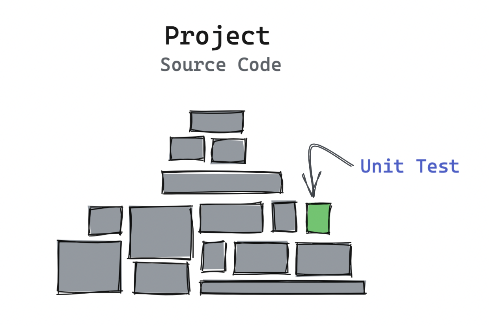
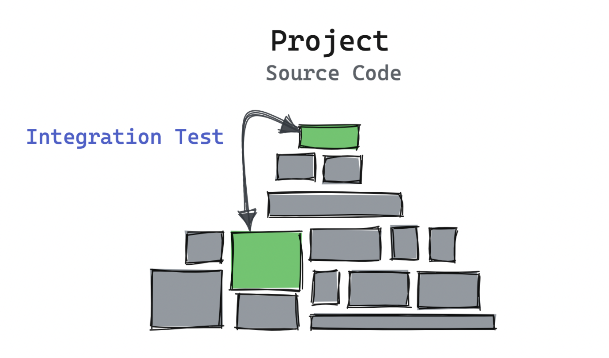
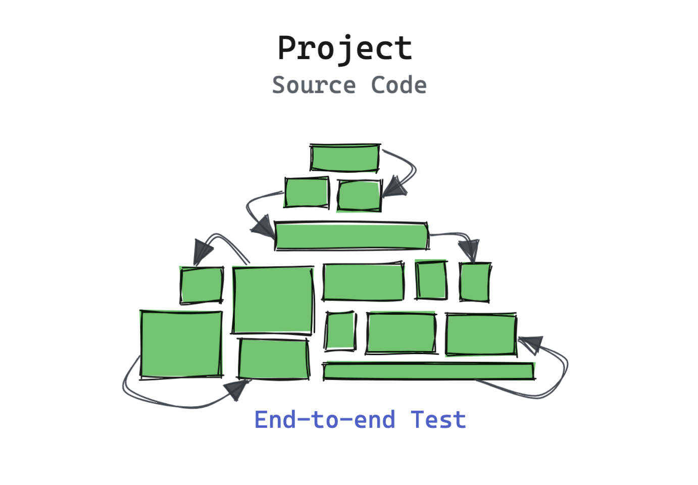
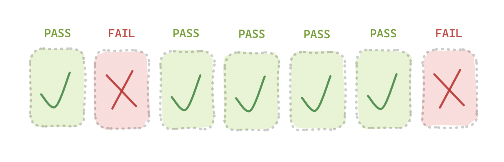
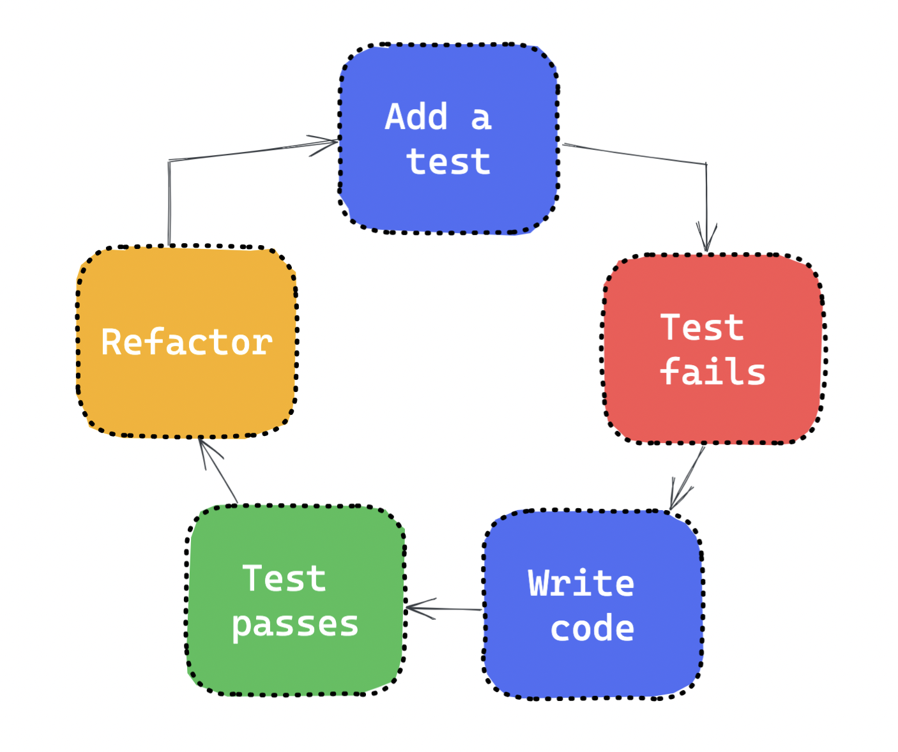

# Testing your software is just as important as writing it

## What do we mean by “testing” software?

Testing software involves **examining the behaviour of software**, and ensuring that the output is what you’re **expecting**.

This can be done manually, where a real person tests specific cases searching for defects, or automatically, through the use of testing tools and writing code for test cases.

Each method involves creating some expectation that is widely accepted on what _should_ happen, and then executing a series of steps to get to the desired state and ensure that the software is working correctly after the steps are complete.

## Different types of tests

### Unit tests

Unit tests involve assessing the behaviour and asserting the output of individual “units” or sections in source code. Units are small components, functions, or modules in the code. Importantly, they are isolated bits of code to be tested and verified to build up to testing bigger functionality.



As an example, you might have a relatively simple function that just adds two numbers:

```js
function add(a, b) {
  if (!a || !b) throw new Error("Error!");
  return a + b;
}
```

Unit tests may look something like this (with the help of a testing library):

```js
it("should add two numbers", () => {
  const result = add(1, 0);
  expect(result).toEqual(1); // should pass
});
```

If we ran the test above, it would be failing at the moment. Why is that? Adding 1 + 0 should equal 1, right? Unfortunately, the code above has a bug. Have you spotted it?

By checking using the logical “not” operator to check if either number is valid at the start of the function, JavaScript is checking if `a` or `b` are “[falsy](https://developer.mozilla.org/en-US/docs/Glossary/Falsy)” values, and `0` counts as a “falsy” value, making the function throw an error.

Asserting each unit is working as expected under different conditions or edge cases means we gain confidence whenever using it anywhere in our project.

Over time, you’ll have hundreds of units tested in your code, building up confidence in each little part of your code, ensuring changes won’t affect functionality in any of the other units.

### Integration tests

Integration tests are where different units, modules, or components in software get tested together and ensuring they work as intended when connected to each other.



For example, a website that involves shopping will require the user to add an item to their cart and sign in. You could add an integration test to ensure that the user can both add an item to their cart and sign in, in sequence, as expected.

### End-to-end tests

End-to-end tests ensure that the entire user journey; their experience from the beginning to the end in the application behaves as expected. It’s meant to simulate a real user scenario and validating the software works consistently when provided certain inputs.



If you had to verify the functionality of user account creation and deletion, and everything in between, you could program a test runner to run your application and perform the individual actions you’ve defined in code, asserting each step got executed correctly.

## Why is testing important?

Writing code is crucial, but we also care about making sure end users get a good experience. Manual and automated testing can be very useful in catching bugs early in the development process, saving time and money for your team and making sure users have a lower chance of a poor experience.

### Confidence, now and for the future

Through [continuous integration](https://docs.github.com/en/actions/automating-builds-and-tests/about-continuous-integration), you can create a pipeline that ensure builds cannot be published to production if tests are failing.

One or more tests failing often indicate something is wrong with a proposed change. If all tests pass, it gives confidence to you and teammates that the changes implemented will work as expected and not break other areas of the experience.

### Get alerted before potential bugs go out to users

Tests allow us to assert the behaviour of software and functions: we tell the tester what _should_ happen, and it compares the _expected_ and _actual_ output. If users don’t get what they’re expecting, they have a worse experience.

Writing test cases allows developers to run software with mocked, fake values to test how they’ll behave under different conditions.

If tests are failing or returning unexpected values, it’s a good indication that there’s a problem somewhere that could potentially affect real users, leading to a bad experience.

### Improves code quality

Testing is important for keeping code quality and maintainability high. Having high test coverage ensures developers don’t need to spend time resolving issues with existing code, and gives confidence around the impact of changes when creating new features or fixes.

## Not having tests is a ticking time-bomb

I want to throw in a personal anecdote here. I can tell you personally that often, not having tests will kick you up the arse later down the road.

The number of times I’ve said “I wish this had tests on it, and we would’ve caught this bug” is higher than I’d like to admit.

The truth is, software is unpredictable, and even though you might have a simple operation, or you are 100% sure everything works as it should; there’s no telling how external factors might change how your software behaves. Having automated tests surfaces more information to you quicker.

As an example, let’s say you’re using an external dependency for calculating time differences. The maintainers might make a breaking change, and if your project updates the dependency, your software isn’t working correctly, and you’ve got no indication of it.

## How to write optimal tests

### Create a strategy around testing

Documenting a plan around what type of testing you need and what components are priority to test is helpful for you and others to get a sense on how test coverage works in your project. Some people might be aiming for 100%, but for some projects that may not be feasible.

Determine which types of tests are right for your software. If you’re making an application used by many people, it might be worth adding end-to-end tests to assess the core experience automatically and pick up potential issues.

### Automating tests where possible

Manually testing can chew into resources and time, and it’s easy to forget things or still have things go wrong. Automating tests in code and setting up tools to interact with your application programatically can save a lot of time and allows you to catch problems early without much effort.

Depending on what language or framework you’re using, you might be able to use an external dependency to assist in asserting your code programatically.

### Avoid “flaky” tests

A flaky test is an assertion on code that fails to produce the same result each time the test gets run. This leads to [false positives (or sometimes false negatives)](https://en.wikipedia.org/wiki/False_positives_and_false_negatives) where code that is not problematic may cause a test to fail, or code that is problematic may not be caught due to a flaky test failing often.

Flaky tests may take a long time to eventually surface and can block the continuous deployment, making feature delivery more complicated and slower than it needs to be and causing headaches for the development team.

They’re typically caused by false assumptions in data being returned, race conditions, or insufficient mocking of calls to external systems to ensure they’re not influencing tests.



### Test-driven development: red, green, refactor

The idea behind [test-driven development](https://testdriven.io/test-driven-development/) is that you actually _write the tests first_ based on requirements, making assertions in different scenarios, and then add the code to make the tests pass.

The tests will fail at the start (_red_) because there’s no logic. You begin to add the logic pertaining to the requirements until all tests are passing (_green_). The last part involves _refactoring_ the code, so it is optimised for production and readable for others.



<!--[PROPERTIES]
- slug: 'testing-software'
  title: 'Testing your software is just as important as writing it'
  description: "Why implementing automated testing is worth it, and how it helps improve reliability and confidence"
  image: cover.jpg
  createdAt: 1651776022000
  location: 'posts/testing-software.mdx'
  readTimeMins: 5
  coverAuthor: Jeswin Thomas
  coverAuthorUrl: https://unsplash.com/@jeswinthomas
  author: Nevulo
  labels:
    - programming
    - testing
    - design
-->
