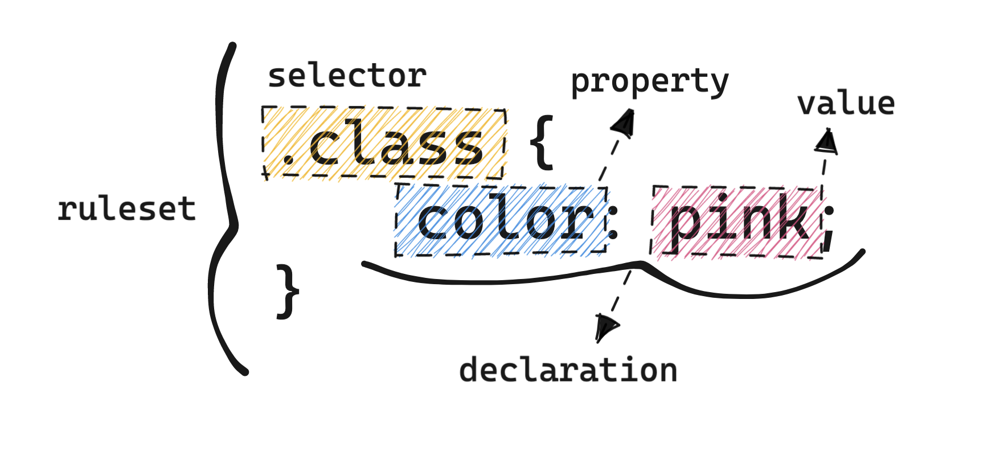

# Diving deep into CSS for beginners

When designing and [creating your own website](https://nevulo.xyz/blog/making-your-own-website), you’ll find yourself using [CSS](https://developer.mozilla.org/en-US/docs/Web/CSS), a language for creating _style sheets_. Style sheets are used to describe the presentation of HTML documents and how elements get displayed.

CSS and styling elements really is the backbone for a lot of user experiences visually speaking; raw HTML will only get you so far.

This guide is top-to-bottom (mostly) explanation about what CSS really is, how it’s used, and common concepts and properties to understand, so you can make your own beautiful webpages.

## What is CSS, and what is it used for?

CSS stands for “Cascading Style Sheets”, which is a mechanism for adding style to web documents, such as adjusting fonts, colours, spacing, layout, and much more. (We’ll get back to that “cascading” part soon!)

CSS is built up on “rulesets” which target elements in a HTML document through _selectors_. Selecting an element to be styled looks like this:

```js
body {
  background: black;
}
```

This snippet would _select_ the `body` element, and turn the background to “black”. `body` can be replaced with any element you want to select, and then you can add _declarations_ through properties and values inside the _curly braces_.

This is what your average HTML element looks like under the hood:


This is known as the “[box model](https://developer.mozilla.org/en-US/docs/Learn/CSS/Building_blocks/The_box_model)”. Abstractly speaking, when making a website, you’re essentially structuring and styling numerous boxes.

You’ve got the actual size of your element (in this case, 750 pixels wide by 150 pixels tall), then _padding_ on the outer edge of the element to increase its internal size.

The border wraps around the padding (the space _inside_ the element), and on the very outside is the _margin_ (the space _outside_ the element).

## Adding CSS to a HTML document

There are a few ways to include CSS styling in a HTML document, but the two most common methods are:

- creating a `.css` file with all of your rulesets, then referencing that CSS file as a stylesheet in the `<head>` of your document

  ```html
  <link href="./style.css" rel="stylesheet" />
  ```

- including CSS rulesets directly in the HTML document in the `<style>` tag, also in the `<head>` of your document
  ```html
  <style>
    .class {
      color: pink;
    }
  </style>
  ```

## Creating & building up rulesets

When styling any element through CSS, the foundation is built up of “rulesets”, which include a _selector_ to access an element (or multiple that meet the requirements of the selector) to be styled.

After the selector, everything between the curly braces is known as a “[declaration block](https://developer.mozilla.org/en-US/docs/Web/API/CSS_Object_Model/CSS_Declaration_Block)”, which can contain one or more declarations. Declarations are a key/value pair, consisting of the _CSS property_ as the key, and a _value_ for the property.



### Selecting an element

There are a few ways to “select” an element to be styled in CSS, depending on your requirements. You can find a full list of selectors [here](https://developer.mozilla.org/en-US/docs/Web/CSS/CSS_Selectors).

- **Element type selector** (`element`)
  - Selects all elements that have the specified node name
  - `input { background: red; }` will match any `<input>` elements on the page, making the background `red`
- **Class selector** (`.class`)
  - Selects all elements that have a class matching the selector
  - HTML elements can have a `class` attribute, including a list of “classes” delimited by spaces
  - An element in the document like `<h1 class='bold'></h1>` could be selected in CSS through `.bold`
- **ID selector** (`#id`)
  - Selects all elements that have an `id` attribute matching the selector value
  - HTML elements can have an `id` attribute
  - An element in the document like `<div id='article'></div>` could be selected in CSS through `#article`

Once you’ve selected an element, you can start adding _declarations_ to change its styling. Note that if you don’t select a valid element, there will be no effect. You can use “Inspect Element” to see what styling is applied on an element to troubleshoot these issues.

### Common properties for declarations

Some inspiration for understanding what you can style through these “declarations”. You can see an entire list of CSS properties [here](https://developer.mozilla.org/en-US/docs/Web/CSS/Reference#index).

#### Colours

`color`: adjusts the foreground colour of an element. The colour of text elements will depend on the `color` value.
`background`: adjusts the background colour of an element

#### Fonts

`font-size`: changes the size of font for text, specified in pixels or other units
`font-family`: defines the type of font used for the text in the element (e.g., Arial, monospace font, etc)

#### Structure

`display`: used for adjusting the layout mode elements use, for positioning and structure
`padding`: adds internal space to an element, making it appear bigger
`margin`: adds external space around an element, pushing other elements away
`border`: applies a customisable border around an element

#### Sizing

`height`: adjusts the height of an element, specified in pixels or relative units
`width`: adjusts the width of an element, specified in pixels or relative units

## Digging deeper in core concepts

### Cascading

They don’t call it “Cascading Style Sheets” for nothin’!

The _cascade_ describes how CSS declarations and rulesets are applied to a HTML document, including how conflicts between two declarations on the same element get handled (i.e., one ruleset sets `margin-left` to `0`, but another sets it to `12px`), and which gets priority.

It controls the order in which CSS declarations are applied, which is dictated by three other concepts:

- **Importance**
  - Where is the declaration applied? Browsers have default styling which is applied by default, but has the _lowest importance_, meaning they’ll be overridden.
- **Specificity**
  - How “detailed” is the selector that the declaration is in? Less _specific_ selectors will take lower priority in being applied.
- **Source order**
  - Last resort, when two declarations affect the same element in the same way: which was declared _first_ within the file?

### Inheritance

Inheritance controls what happens if there’s no value for a specific property on an element. Essentially, if you set a CSS property like `color` on an element, any child elements will _inherit_ the colour from the parent unless child elements have explicitly defined a colour.

There’s a distinction between [_inherited_ and _non-inherited_](https://developer.mozilla.org/en-US/docs/Web/CSS/inheritance#inherited_properties) properties; non-inherited properties (such as `border`) will use the _initial_ value for that property, [not to be confused](https://www.w3.org/TR/CSS22/cascade.html#specified-value) with the browsers default style sheet. All properties specify an `initial` value.

If you want to explicitly define that an element should inherit a property from its parent, almost all CSS properties include an `inherit` value (e.g., `color: inherit`), which will set the value of the property to the [computed value](https://developer.mozilla.org/en-US/docs/Web/CSS/computed_value) of that property in the parent. This works for both inherited and non-inherited properties.

### Specificity

The more specific a selector is, the more precedence it has over other declarations. Specificity is a weight given to all declarations, determined by 3 factors:

- the number of element types in the selector
- the number of classes in the selector
- the number of IDs in the selector

If multiple declarations have equal specificity, the last declaration found in the CSS gets applied to the element.

<!--[PROPERTIES]
- slug: 'what-is-css'
  title: 'Diving deep into CSS for beginners'
  description: "What is CSS, what is it used for, and how can we make a beautiful site with properties and values?"
  image: cover.jpg
  createdAt: 1646821716000
  location: 'posts/what-is-css.mdx'
  readTimeMins: 5
  coverAuthor: Neven Krcmarek
  coverAuthorUrl: https://unsplash.com/@nevenkrcmarek
  author: Nevulo
  labels:
    - web design
    - css
-->
