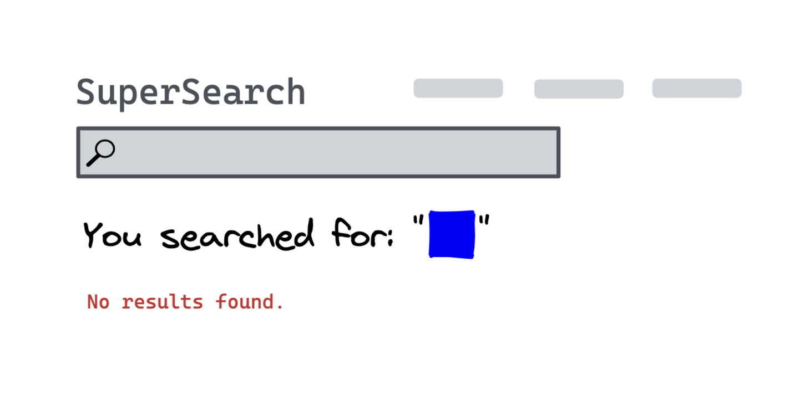

# What is cross-site scripting (XSS) and how does it work?

⚠️ This post is purely for explanatory purposes—you should not attempt to perform any type of security attack on a website unless you have approval.

## What is cross-site scripting?

Cross-site scripting is an attack performed on websites, where an attacker can inject some malicious code or scripts that get executed to modify the behaviour of that website.

This is ultimately a **security vulnerability**, and can be very dangerous if your website accepts and shows user input, but isn’t properly protected.

Cross-site scripting is an old attack, dating back to the 90s, so the name is a bit outdated. The scope of code injection has increased since then, and so “cross-site” isn’t as relevant these days – you can often perform most XSS attacks directly within the website.

But it doesn’t make it any less important today. The [Open Web Application Security Project (OWASP)](https://owasp.org/ "Open Web Application Security Project (OWASP)") have curated a [list of the top ten web application security risks in 2021](https://owasp.org/Top10/ "list of the top ten web application security risks in 2021"), and “injection” (which includes cross-site scripting) had _274 thousand_ occurrences. 🤯

### Types of XSS

There are two _main types_ of cross-site scripting:

- _Reflected_ (non-persistent) XSS, is where the malicious input comes from the current HTTP request, in the form of [query parameters](https://developer.mozilla.org/en-US/docs/Web/API/URL/searchParams#examples "query parameters") or headers for example.

  The malicious request _reflects_ off the web server, where the response reflects the attack back to the user’s browser. Only works for that request, or anyone else who makes the same request.

- _Stored_ (persistent) XSS, is where the malicious input gets **stored** in a permanent place like a database.
  Each time the page gets requested, the malicious input gets requested from the database and included in the response, causing it to be rendered as raw HTML.

## How is cross-site scripting achieved?

Ultimately, there’s no single way to perform an XSS attack, as there are many vectors to attack and considerations per website that can change what code will be required.

A common example includes something like this; let’s say there’s a website with a search box that displays my search input back to me:

1. I search for “**nevulo**”, sending a request to the server with my query (_usually_ through query parameters, but somewhere in the request)

2. I go to a new webpage containing my search results, including the search term I used
   
   The important thing to understand is that the DOM contains your user input.

The problem starts to creep in when you consider that users can enter [HTML](https://nevulo.xyz/blog/making-your-own-website "HTML") code in the input, and if the content returned is not [sanitised](https://en.wikipedia.org/wiki/HTML_sanitization "sanitised") properly (meaning any user input gets stripped of HTML), it won’t just show the HTML code, it will render it _literally_.

The browser doesn’t know any different – it will just execute whatever HTML it sees as long as it’s valid.
If I type in:

```html
<div style="background: blue; width: 32px; height: 32px;"></div>
```


It ends up showing we searched for a blue square. This is an example of _reflected XSS_.

If the website takes the input from those request parameters and returns a new page containing your input as-is, the renderer doesn’t know the difference between the real website code and the injected code.

So, whatever code you write in the input box in this vulnerable website, it will render the output as if the page as it would with your extra code.

But, this is dangerous ⛔️

## Why is cross-site scripting so dangerous?

Let’s say you’ve just built a new social media platform, and your platform gives users the ability to post little pieces of content on their personal, public wall.
I’ll explain _how_ you introduce this vulnerability in a site, but for now, just know your site is vulnerable to XSS.

_I’ll_ sign up for your social platform because it’s wonderful.
Now that I’ve got my account, I want to post my first piece of content to my wall!
But, I’ve got a sneaky trick up my sleeve.

When I go to the input box to post on my wall, I’m going to type this in:

```html
<script>
  alert("JavaScript");
</script>
```

And post!
Anyone who visits my profile won’t see any content on my wall, they’ll just see an alert box in their browser that says “JavaScript”. This is an example of _stored XSS_.

XSS is a dangerous vulnerability because if you can _inject **any** valid HTML_ into a website, you can inject malicious elements like `script`, which allows you to execute JavaScript in the context of the window, and that’s **a lot** of power.

Some examples of malicious things you can do with access to JavaScript include:

- Stealing cookies (which may contain session data or other sensitive information)
- Changing how the page looks by modifying the DOM (Document Object Model)
- Redirecting users to another page

All of these examples and more pose a serious threat to users of your website if vulnerable.

## How does cross-site scripting become a vulnerability on a website?

There are different types of XSS which can be used to attack websites, so there’s no one single way to introduce the vulnerability.

Reflected XSS is one of the most common types of attacks, and it typically becomes a vulnerability on most websites when the website **accepts user input** (typically query parameters) which is _not sanitised properly_. Then, that **user input gets rendered in the response**.

Imagine if a site had search functionality – it might look something like this:

1. A user visits a maliciously crafted URL containing HTML code to execute JavaScript in the query parameters.
   ```</>
   https://example.com/explore?search=<script>alert('JavaScript');</script>
   ```
2. A request gets sent to the server, which adds the `search` query parameter to the final HTML to be sent back to the user without any sanitisation:
   ```php
   <html>
   	<body>
   		<p><?php echo 'You searched for: ' . $_GET["search"]; ?></p>
   	</body>
   </html>
   ```
3. The final HTML gets rendered in the browser and the `script` tag gets executed, causing an alert to appear for the user.

**Stored** XSS, on the other hand, happens when some user input (say, for a comment on a blog), is stored in a permanent location like a database, and then that user content gets rendered back on the page.

If the input does not get sanitised properly, and it contains HTML code, it will load the user-generated content and render the content as HTML.

Stored XSS might look something like this in action:

1. A user sends a request to a server to update/create data that will be rendered on some page. This contains malicious HTML input.

2. At some point, a user makes a request and the server responds with the relevant data that the user tainted with raw HTML, and that data gets used directly within the HTML response and sent back to the user.

3. The final page containing the injected HTML code renders in the user's browser and the JavaScript code executes.

## How do you protect against XSS?

On most sites, you don’t want users to enter raw HTML code and return the user's input as code to be executed on your page.

Below is a non-exhaustive list of options for preventing XSS attacks on your website if your website accepts user input, and displays it back to them in any way (through an input box, query parameters, etc):

### Validating user input

The first line of defence that can give _some_ assurance that users won’t be able to enter certain characters you don’t want, like `<` `>` angled brackets that are used in HTML.

This is obviously not fool-proof, there are many workarounds for entering HTML without strictly using angled brackets.

But, if you’re just setting out to store somebody’s age and then display it back to them on their profile, it’s best to stop any malicious input at the start if _you know_ the stored input will never need to use HTML characters.

**Validation must be present on the backend**, and not just the frontend. It’s easy for users to bypass the frontend validation and send bogus/malicious data to your backend. Your backend acts as a source of truth, since users cannot manipulate your backend logic.

### Escaping your output where you use user input

If you’re returning a HTML document to users where the final result can be modified based on input parameters, before you return the document, you should escape any user input used within the document.

```php
<html>
	<body>
		<h1>Your name is <?php
		$new = htmlspecialchars($userInput, ENT_QUOTES);
		echo $new;
		?></h1>
	</body>
</html>
```

If the input is: `<script>alert(1)</script>`

The final output will look something like this:
`Your name is &lt;script&gt;alert(1)&lt;/script&gt;`

This is a lot better rather than running the malicious code in the users' browser!

Generally, when escaping content, you’ll be passing the user input you want to show on the page through a function that will return the same input, just without any special characters used in HTML.

This will be different depending on which templating system you’re using (some do this by default, automatically). Make sure to look up a recent tutorial for escaping user input with whatever templating system you’re using.

### Implementing a `Content-Security` policy

A content security policy allows you to dictate where JavaScript (and other resources) can be loaded or executed from.

Since XSS attacks rely on the attacker being able to run scripts on a vulnerable website, either by injecting scripts directly within the webpage, or getting the browser to download scripts from an untrusted third-party.

The content security policy works through “directives” that allow you to create an allowlist of sources of trusted content, and instructs the browser to only execute or render resources from those sources.

Adding a `Content-Security-Policy` to your website through the HTTP response headers looks like this:

```HTTP
Content-Security-Policy: script-src 'self'
```

You can also specify the `Content-Security-Policy` through the `meta` tag in your HTML document:

```html
<meta http-equiv="Content-Security-Policy" content="script-src 'self'" />
```

In the policy above, there is one directive `script-src` which controls a set of script-related privileges, and `self` (the current page) is the only valid source. By default, it will also disable the ability to use inline scripts, which is one of the biggest security implications of using the policy.

This effectively means that any attacker attempting to inject code in your site will be unsuccessful and see an error.

<!--[PROPERTIES]
- slug: 'what-is-xss'
  title: 'What is cross-site scripting (XSS) and how does it work?'
  description: "What I want to achieve with the blog, and how it works behind the scenes"
  image: cover.jpg
  createdAt: 1646821716000
  location: 'posts/what-is-xss.mdx'
  readTimeMins: 7
  coverAuthor: Clay Banks
  coverAuthorUrl: https://unsplash.com/@claybanks
  author: Nevulo
  labels:
    - programming
    - web
    - security
-->
